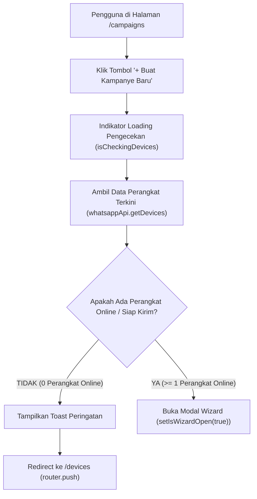

# 📱 Rencana Desain & Implementasi: Pengecekan Perangkat Online & Auto-Redirect ke `/devices` saat Membuat Kampanye

Dokumen ini merinci alur validasi status perangkat WhatsApp sebelum modal pembuatan kampanye siaran (*Campaign Wizard Modal*) dibuka pada halaman `http://localhost:3000/campaigns`.

---

## 1. 🔍 Latar Belakang & Kebutuhan Pengguna

* **Kebutuhan**:
  Saat pengguna mengklik tombol **"+ Buat Kampanye Baru"** (*Create Campaign*):
  1. Sistem **tidak boleh** langsung membuka modal wizard jika pengguna belum memiliki perangkat WhatsApp yang aktif/online.
  2. Sistem harus melakukan verifikasi status perangkat WhatsApp secara *real-time*.
  3. Jika **tidak ada perangkat online/terhubung** (semua perangkat offline/putus atau belum ada perangkat yang didaftarkan):
     - Tampilkan pesan notifikasi peringatan/toast yang informatif (misal: *"Tidak ada perangkat WhatsApp yang aktif. Mengarahkan Anda ke halaman perangkat..."*).
     - Otomatis **redirect** pengguna ke halaman **`http://localhost:3000/devices`** agar pengguna menghubungkan atau menyalakan perangkat terlebih dahulu.
     - Modal wizard **tidak dibuka**.
  4. Jika **ada perangkat online/terhubung**:
     - Buka modal wizard pembuatan kampanye seperti biasa sehingga pengguna dapat langsung memilih nomor pengirim dan meluncurkan siaran.

---

## 2. 🎨 Rancangan Alur Pengguna (User Flow)



---

## 3. 🛠️ Spesifikasi Perubahan File

### A. Lokalisasi i18n
Menambahkan kunci terjemahan peringatan di:
1. **[`src/locales/id/campaign.json`](file:///g:/WEB2026/fontwahide/src/locales/id/campaign.json)**:
   ```json
   "noActiveDeviceRedirect": "Tidak ada perangkat WhatsApp yang terhubung/aktif. Silakan hubungkan perangkat terlebih dahulu."
   ```
2. **[`src/locales/en/campaign.json`](file:///g:/WEB2026/fontwahide/src/locales/en/campaign.json)**:
   ```json
   "noActiveDeviceRedirect": "No active WhatsApp device found. Please connect a device first."
   ```

### B. Modifikasi [`CampaignList.tsx`](file:///g:/WEB2026/fontwahide/src/modules/campaign/components/broadcast/CampaignList.tsx)
1. Import `useRouter` dari `next/navigation`, `toast` dari `sonner`, dan `whatsappApi` dari `@/modules/whatsapp/api/whatsapp.api`.
2. Tambahkan state `isCheckingDevices = useState(false)`.
3. Buat fungsi handler `handleCreateCampaignClick`:
   ```tsx
   const router = useRouter();
   const [isCheckingDevices, setIsCheckingDevices] = useState(false);

   const handleCreateCampaignClick = async () => {
     if (isCheckingDevices) return;
     setIsCheckingDevices(true);
     try {
       const devices = await whatsappApi.getDevices();
       const activeDevices = devices.filter(
         (d) => d.status === "CONNECTED" || (d.status as string) === "ONLINE" || d.status === "HIBERNATED"
       );

       if (activeDevices.length === 0) {
         toast.error(t("campaign.noActiveDeviceRedirect"));
         router.push("/devices");
         return;
       }

       setIsWizardOpen(true);
     } catch (err: unknown) {
       const msg = err instanceof Error ? err.message : "Gagal memeriksa status perangkat";
       toast.error(msg);
     } finally {
       setIsCheckingDevices(false);
     }
   };
   ```
4. Ganti event `onClick={() => setIsWizardOpen(true)}` pada kedua tombol (di Top Action Bar dan di Empty State) dengan `onClick={handleCreateCampaignClick}`.
5. Berikan feedback loading visual (animasi `Loader2` saat `isCheckingDevices === true`).

---

## 4. 📋 Rencana Pengujian & Quality Gate

1. **TypeScript Check**: `bun x tsc --noEmit`
2. **ESLint**: `bun run lint`
3. **Prettier**: `bun run format`
4. **Kepatuhan Aturan**:
   - ❌ Tidak menjalankan `bun run build`.
   - ❌ Tidak melakukan `git push`.
5. **Verifikasi Fungsional**:
   - Uji klik tombol saat akun tidak memiliki perangkat / semua perangkat offline $\rightarrow$ Muncul toast peringatan dan halaman otomatis berpindah ke `/devices`.
   - Uji klik tombol saat ada perangkat online $\rightarrow$ Modal wizard terbuka mulus.
