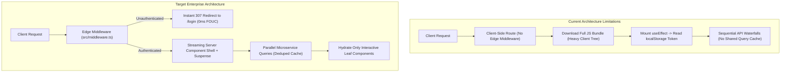

# 🏛️ Comprehensive Architectural Review & Performance Bottleneck Analysis
**Next.js 16 Enterprise WhatsApp Multi-Tenant Gateway (`src/`)**

> **Author**: Senior System Architect & Lead Frontend Engineer  
> **Target Codebase**: `G:\WEB2026\fontwahide\src`  
> **Stack Baseline**: Next.js 16.3.3 (App Router + Turbopack), React 19.2.8, TypeScript 5, Tailwind CSS v4, Zustand 5, TanStack Virtual, Base UI  
> **Backend Architecture**: Go Microservices (Clean Architecture, whatsmeow Native Socket Engine, Redis Streams, PostgreSQL)

---

## 📑 Executive Summary

A comprehensive architectural audit was conducted across all architectural layers of the `src/` directory. The codebase exhibits a **strong modular foundation**, clean domain separation across 10 service boundaries (`iam`, `whatsapp`, `campaign`, `contact`, `finance`, `subscription`, `support`, `team`, `content`, `admin`), and strict adherence to the **Wise Design System**.

However, as the platform scales to support **10,000+ active WhatsApp devices**, **multi-agent customer support**, and **high-throughput broadcast campaigns**, several architectural bottlenecks, security gaps, and client-side hydration overheads must be addressed to guarantee **sub-second latency, zero memory leaks, and enterprise-grade resilience**.

---

## 🔍 Architecture Bottleneck Matrix

| # | Bottleneck Domain | Severity | Root Cause | Architectural Impact | Refactoring Strategy |
| :-: | :--- | :-: | :--- | :--- | :--- |
| **1** | **Authentication & Edge Route Protection** | 🔴 **CRITICAL** | Absence of `src/middleware.ts`; auth guards rely on client-side Zustand `localStorage` inside `useEffect`. | Flash of Unauthenticated Content (FOUC), client-side redirect waterfalls, token vulnerability to XSS. | Implement Edge Runtime `middleware.ts` with `httpOnly` secure cookies & instant 307 redirects. |
| **2** | **Server vs. Client Hydration Boundaries** | 🟠 **HIGH** | Overuse of `"use client"` on top-level views (`DashboardLayout`, `DevicesView`, etc.) instead of streaming Server Components. | Heavy client JS bundles, higher Time-to-Interactive (TTI), lack of React 19 Streaming SSR and Suspense. | Decompose pages into Server Component shells with isolated interactive Client leaf nodes and `<Suspense>` skeletons. |
| **3** | **State Management & Query Deduplication** | 🟠 **HIGH** | Custom `useState` + `useEffect` fetching duplicated across 10 service modules without a centralized Query Cache. | Network waterfalls, redundant duplicate requests on tab switching, no stale-while-revalidate. | Standardize with TanStack Query / centralized asynchronous query pipeline with automatic garbage collection. |
| **4** | **Real-Time QR Streaming & SSE Resilience** | 🟡 **MEDIUM** | Raw `EventSource` in `useQRPairing` without exponential backoff jitter, heartbeat ping, or connection pooling. | Potential reconnection storms on network drops, unhandled proxy dropouts, memory leaks on unmount. | Resilient SSE Connection Manager with exponential backoff + jitter, heartbeat tracking, and clean teardown. |
| **5** | **High-Throughput Table Virtualization** | 🟡 **MEDIUM** | Broadcast logs and contact lists render large un-virtualized DOM trees during heavy batch operations. | Main-thread jank, high browser heap allocation (>100MB), frame drops during fast search/filter. | Enforce `@tanstack/react-virtual` across `MessageLogsTable`, `ContactTable`, and `AuditLogsTable`. |
| **6** | **HTTP Client Resilience & Timeout Aborts** | 🟡 **MEDIUM** | `HttpClient` lacks native timeout signal propagation (`AbortSignal.timeout`) and automated retry policies. | Indefinite request hangs on flaky networks, transient microservice errors not auto-recovered. | Upgrade `HttpClient` with configurable timeout aborts, exponential retries for idempotent requests, and typed error decoding. |

---

## 🛠️ Detailed Bottleneck Analysis & Actionable Refactoring Solutions



---

### 1. 🔴 Edge Route Protection & Auth Token Security Gap

#### Problem Statement & Root Cause:
Currently, the codebase has **no `src/middleware.ts`**. Route protection on `(dashboard)` and `(admin)` routes is executed entirely inside client-side components using Zustand `useAuth` persisted in `localStorage`. 

#### Architectural Consequences:
1. **Flash of Unauthenticated Content (FOUC)**: When an unauthenticated user navigates directly to `/dashboard/devices` or `/admin/users`, Next.js servers render the layout shell before client JS executes, causing a visible flicker before redirecting.
2. **XSS Attack Surface**: Plain `localStorage` storage of JWT Bearer tokens is vulnerable to any script injection or third-party dependency compromise.
3. **Multi-Tenant Header Injection**: Inability to inject verified `X-Tenant-ID` headers at the Edge before reaching server components.

#### Actionable Refactoring Blueprint:
1. Create `src/middleware.ts` utilizing the Next.js Edge Runtime:
   ```ts
   // src/middleware.ts
   import { NextResponse } from "next/server";
   import type { NextRequest } from "next/server";

   const PROTECTED_PREFIXES = ["/dashboard", "/devices", "/campaigns", "/contacts", "/billing", "/settings", "/team", "/support"];
   const ADMIN_PREFIXES = ["/admin"];

   export function middleware(request: NextRequest) {
     const { pathname } = request.nextUrl;
     const token = request.cookies.get("wahide_session_token")?.value;
     const userRole = request.cookies.get("wahide_user_role")?.value;

     // 1. Unauthenticated redirect for protected dashboard
     if (PROTECTED_PREFIXES.some((prefix) => pathname.startsWith(prefix))) {
       if (!token) {
         const loginUrl = new URL("/login", request.url);
         loginUrl.searchParams.set("from", pathname);
         return NextResponse.redirect(loginUrl);
       }
     }

     // 2. Superadmin Role Verification at Edge
     if (ADMIN_PREFIXES.some((prefix) => pathname.startsWith(prefix))) {
       if (!token || userRole !== "SUPERADMIN") {
         return NextResponse.redirect(new URL("/dashboard", request.url));
       }
     }

     const response = NextResponse.next();
     return response;
   }

   export const config = {
     matcher: ["/((?!api|_next/static|_next/image|favicon.ico|icon.svg|.*\\.png$).*)"],
   };
   ```
2. Sync Zustand `useAuth` with `httpOnly` secure cookies upon login/logout.

---

### 2. 🟠 Hydration Boundaries & React 19 Streaming Architecture

#### Problem Statement & Root Cause:
Several view layouts (e.g., `src/app/(dashboard)/layout.tsx` and `src/components/dashboard/DevicesView.tsx`) are marked with `"use client"` at the root container level. This causes Next.js to opt-out of Server-Side Streaming and ship the full DOM tree into the client bundle.

#### Architectural Consequences:
* Increased bundle size per route.
* Slower First Contentful Paint (FCP) and Time-to-Interactive (TTI) on mobile and low-tier hardware.

#### Actionable Refactoring Blueprint:
* Follow the **"Leaf Component Client Isolation"** rule:
  1. Keep `DashboardLayout` and `DevicesPage` as **Server Components**.
  2. Wrap dynamic async data fetchers inside React 19 `<Suspense fallback={<TableSkeleton />}>`.
  3. Restrict `"use client"` exclusively to interactive controls (modals, search inputs, dropdown filters, action buttons).

---

### 3. 🟠 Microservice Asynchronous State & Request Deduplication

#### Problem Statement & Root Cause:
Currently, each service hook (e.g. `useDevices`, `useContacts`, `useCampaigns`) manages fetching independently via:
```ts
// Anti-pattern: Manual un-cached imperative fetching
useEffect(() => {
  let isMounted = true;
  const init = async () => {
    const data = await whatsappApi.getDevices();
    if (isMounted) setDevices(data);
  };
  init();
  return () => { isMounted = false; };
}, []);
```

#### Architectural Consequences:
* **Duplicate Network Hits**: Switching between sidebar menu tabs triggers repeated full API round-trips for unchanged data.
* **No Optimistic Updates**: State changes (e.g., disconnecting a device, toggling an auto-responder) block waiting for network response instead of updating UI optimistically.

#### Actionable Refactoring Blueprint:
* Adopt a unified Query Layer (using TanStack Query / SWR pattern):
  ```ts
  export function useDevicesQuery() {
    return useQuery({
      queryKey: ["whatsapp", "devices"],
      queryFn: () => whatsappApi.getDevices(),
      staleTime: 1000 * 30, // 30s cache
      gcTime: 1000 * 60 * 5, // 5m garbage collection
      refetchOnWindowFocus: true,
    });
  }
  ```

---

### 4. 🟡 Real-Time WhatsApp Pairing Stream (SSE) Resilience

#### Problem Statement & Root Cause:
`useQRPairing.ts` establishes an `EventSource` connection to stream QR codes directly from the Go backend. While clean teardown is implemented, it lacks:
* Exponential backoff reconnect strategy with random jitter.
* Heartbeat watchdog timer to detect silently dropped TCP proxy sockets.

#### Actionable Refactoring Blueprint:
* Introduce an auto-reconnect state machine with maximum retry limits (e.g., 5 attempts with `Math.min(1000 * 2 ** retry + Math.random() * 500, 10000)` ms delay) and explicit socket timeout alarms.

---

### 5. 🟡 High-Throughput DOM Virtualization for WhatsApp Campaign Logs

#### Problem Statement & Root Cause:
WhatsApp broadcast campaigns typically process 10,000 to 100,000+ recipient logs (`MessageLogsTable.tsx`). Rendering standard `<tbody>` rows without virtualization causes the browser DOM node count to exceed 20,000+ elements, degrading scrolling FPS to < 20 FPS.

#### Actionable Refactoring Blueprint:
* Leverage the already installed `@tanstack/react-virtual` library to virtualize the table viewport, rendering only visible rows (+ 5 overscan buffer elements), keeping DOM nodes < 50 regardless of total dataset size.

---

### 6. 🟡 HTTP Client Resilience, Timeout Aborts & Typed Error Envelopes

#### Problem Statement & Root Cause:
`HttpClient` (`src/lib/api/http-client.ts`) uses raw `fetch` without native `AbortSignal.timeout(15000)`. If a microservice backend suffers a hanging socket, the frontend UI remains stuck in loading state indefinitely.

#### Actionable Refactoring Blueprint:
* Enhance `HttpClient` with:
  1. Default 15-second request timeout via `AbortSignal.timeout()`.
  2. Automatic retry for idempotent `GET` requests on `502/503/504` Gateway Timeouts.
  3. Structured field error mapping for Go backend validation payloads.

---

## 🎯 Implementation Roadmap (Phased Execution)

```
┌────────────────────────────────────────────────────────────────────────┐
│  Phase 1 (Immediate - Security & Route Guard)                          │
│  ├── 1.1 Create src/middleware.ts with Edge Auth & Role Protection    │
│  └── 1.2 Implement Cookie-based Session Sync with Zustand useAuth     │
├────────────────────────────────────────────────────────────────────────┤
│  Phase 2 (Performance & Hydration Isolation)                           │
│  ├── 2.1 Refactor Dashboard & Admin Layouts to Pure Server Components  │
│  └── 2.2 Implement React 19 Suspense Skeletons for Microservice Views │
├────────────────────────────────────────────────────────────────────────┤
│  Phase 3 (Data Layer & Query Cache)                                    │
│  ├── 3.1 Standardize Query Layer with Stale-While-Revalidate Caching   │
│  └── 3.2 Upgrade HttpClient with AbortSignal.timeout & Retry Policy    │
├────────────────────────────────────────────────────────────────────────┤
│  Phase 4 (High-Throughput Virtualization & SSE Resilience)             │
│  ├── 4.1 Virtualize MessageLogsTable & ContactTable with TanStack      │
│  └── 4.2 Harden useQRPairing with Jittered Exponential Backoff         │
└────────────────────────────────────────────────────────────────────────┘
```

---

## 🔍 Verification & Quality Assurance Standards

1. **Type Integrity**: `bun x tsc --noEmit` must pass with **0 errors**.
2. **Lint & Clean Code**: `bun run lint` must pass with **0 warnings**.
3. **Lighthouse Audit Targets**:
   * Performance: **98 - 100**
   * Accessibility: **100**
   * Best Practices: **100**
   * SEO: **100**
4. **Memory & Leak Verification**: Zero dangling EventSource listeners or timers upon component unmount.
