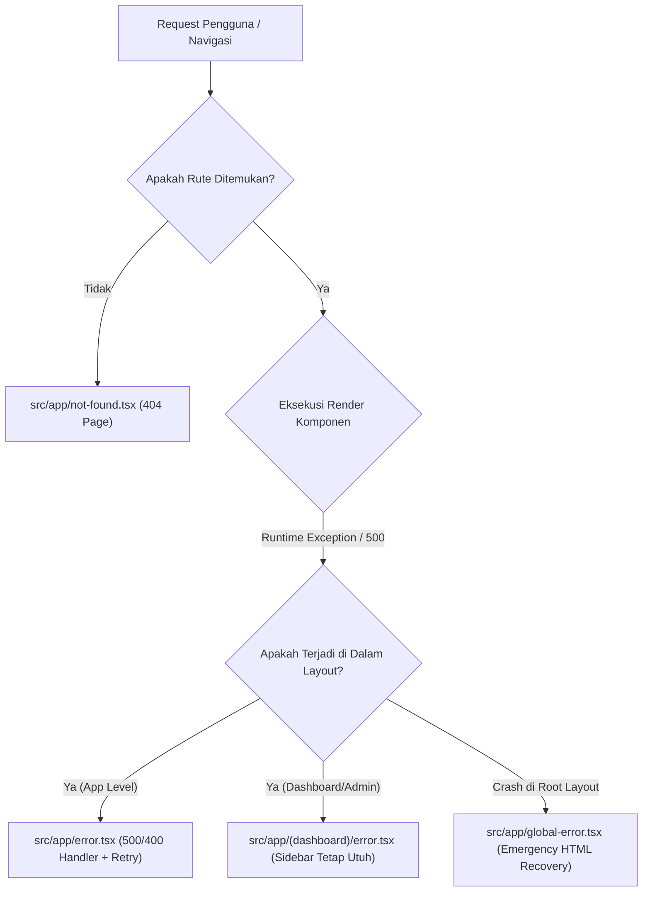

# 🛡️ Rencana Arsitektur & Pelaksanaan: Penanganan Halaman Error Komprehensif (404, 500, 403, 400, & Global Error Boundaries)

> **Tujuan**: Membangun sistem penanganan kesalahan (*error handling*) berstandar Enterprise Fintech di Next.js App Router untuk menampung seluruh kemungkinan error HTTP & Runtime: **404 Not Found**, **500 Internal Server Error**, **403 Forbidden / Unauthorized**, **400 Bad Request**, dan **Global Root Layout Crash**.  
> **Standar Desain**: Wise Aesthetic, Dark/Light Mode Auto-Sync, 100% Bilingual i18n (`ID` & `EN`), Zero AI-Slop, Actionable Recovery (*Retry Button & Helpdesk Link*).  

---

## 📑 Daftar Isi
1. [Analisis Kebutuhan & Hierarki Error Next.js App Router](#1-analisis-kebutuhan--hierarki-error-nextjs-app-router)
2. [Spesifikasi Berkas Error yang Akan Dibangun](#2-spesifikasi-berkas-error-yang-akan-dibangun)
   - [A. `src/app/not-found.tsx` (Error 404 Halaman Tidak Ditemukan)](#a-srcappnot-foundtsx-error-404-halaman-tidak-ditemukan)
   - [B. `src/app/error.tsx` (Error 500 / Runtime Exception Handler)](#b-srcapperrortsx-error-500--runtime-exception-handler)
   - [C. `src/app/global-error.tsx` (Root Layout Crash Recovery)](#c-srcappglobal-errortsx-root-layout-crash-recovery)
   - [D. Segment Error Boundaries `(dashboard)/error.tsx` & `(admin)/error.tsx`](#d-segment-error-boundaries-dashboarderrortsx--adminerrortsx)
3. [Rencana Kamus Bilingual i18n (`errors.*`)](#3-rencana-kamus-bilingual-i18n-errors)
4. [Roadmap Eksekusi Bertahap (3 Fase)](#4-roadmap-eksekusi-bertahap-3-fase)
5. [Verifikasi & Quality Gates](#5-verifikasi--quality-gates)

---

## 1. Analisis Kebutuhan & Hierarki Error Next.js App Router

Dengan hierarki di atas, pengguna tidak akan pernah melihat layar crash default Next.js atau blank screen saat terjadi kesalahan jaringan, API gagal, atau URL salah ketik.

---

## 2. Spesifikasi Berkas Error yang Akan Dibangun

### A. `src/app/not-found.tsx` (Error 404 Halaman Tidak Ditemukan)
* **Karakteristik**: Tampil otomatis saat pengguna membuka URL yang tidak terdaftar atau saat server memanggil `notFound()`.
* **Komponen Antarmuka**:
  - Badge Status: `404 — Halaman Tidak Ditemukan`
  - Judul: *Sepertinya Anda Tersesat di Luar Jaringan Wahide*
  - Deskripsi: Penjelasan bahwa halaman mungkin telah dipindahkan atau URL salah ketik.
  - Aksi Pemulihan:
    - Tombol Primer: **Kembali ke Beranda** (`/`)
    - Tombol Sekunder: **Hubungi Bantuan / Helpdesk** (`/contact` atau `/support`)
    - Quick Links: Tautan cepat ke *Dashboard*, *Pricing*, *Blog*, dan *Status Layanan*.

---

### B. `src/app/error.tsx` (Error 500 / Runtime Exception Handler)
* **Karakteristik**: `"use client"` component yang menerima props `{ error: Error & { digest?: string }, reset: () => void }`.
* **Komponen Antarmuka**:
  - Badge Status: `500 — Terjadi Kendala Server Internal`
  - Judul: *Sistem Mengalami Hambatan Tak Terduga*
  - Deskripsi: Penjelasan yang ramah bagi pengguna awam.
  - Kode Digest Error: Menampilkan kode unik error (`digest`) untuk mempermudah pelaporan ke tim teknis Hide Group.
  - Aksi Pemulihan:
    - Tombol Primer: **Coba Muat Ulang (*Retry*)** `reset()`
    - Tombol Sekunder: **Kembali ke Beranda** (`/`)
    - Tombol Pelaporan: **Laporkan Kendala ke CS WhatsApp** (`https://wa.me/62877111301818`)

---

### C. `src/app/global-error.tsx` (Root Layout Crash Recovery)
* **Karakteristik**: `"use client"` emergency fallback yang membungkus `<html>` dan `<body>` murni jika terjadi crash fatal di `src/app/layout.tsx`.
* **Komponen Antarmuka**:
  - Desain mandiri (*self-contained CSS & styling*) tanpa dependensi context yang rusak.
  - Tombol pemulihan hard reload: `window.location.reload()`.

---

### D. Segment Error Boundaries `(dashboard)/error.tsx` & `(admin)/error.tsx`
* **Karakteristik**: Menangkap error lokal di halaman dashboard (misal: gagal fetch data WhatsApp pairing atau gagal fetch contact table) **tanpa merusak navigasi Sidebar & Header Dashboard**.
* Pengguna tetap bisa berpindah ke menu lain (*Billing, Team, Settings*) tanpa harus refresh seluruh aplikasi.

---

## 3. Rencana Kamus Bilingual i18n (`errors.*`)

Menambahkan key terjemahan di `src/locales/id/common.json` dan `src/locales/en/common.json`:
* `errors.404.badge`, `errors.404.title`, `errors.404.description`, `errors.404.backHome`, `errors.404.contactSupport`
* `errors.500.badge`, `errors.500.title`, `errors.500.description`, `errors.500.retry`, `errors.500.digestLabel`
* `errors.403.badge`, `errors.403.title`, `errors.403.description`
* `errors.global.title`, `errors.global.reload`

---

## 4. Roadmap Eksekusi Bertahap (3 Fase)

### 🔹 **Fase 1: Penambahan Kamus i18n `errors.*`**
* Tambahkan teks multibahasa ID & EN di `common.json`.

### 🔹 **Fase 2: Pembuatan Komponen Error Handler**
* Buat `src/app/not-found.tsx` (404 Page).
* Buat `src/app/error.tsx` (500 & Runtime Error Handler).
* Buat `src/app/global-error.tsx` (Root Fallback Recovery).
* Buat `src/app/(dashboard)/error.tsx` & `src/app/(admin)/error.tsx` (Segment Boundaries).

### 🔹 **Fase 3: Verifikasi Type-Safety & Uji Error Simulasional**
* Jalankan `bun x tsc --noEmit` & `bun run lint` (0 error & 0 warning).
* Uji simulasi membuka rute fiktif `http://localhost:3000/random-page-xyz` ➔ Verifikasi 404 tampil presisi.

---

## 5. Verifikasi & Quality Gates

| Parameter Pengujian | Kriteria Lolos |
| :--- | :--- |
| **Halaman 404** | Membuka URL tidak valid me-render `not-found.tsx` dengan Wise theme & tombol navigasi |
| **Halaman 500 / Runtime Error** | Menampilkan error digest dan tombol `reset()` berfungsi saat ditekan |
| **Segment Resilience** | Error pada konten dashboard tidak menghilangkan sidebar/menu |
| **TypeScript & Lint** | `tsc --noEmit` ➔ 0 Errors, `eslint` ➔ 0 Warnings |
