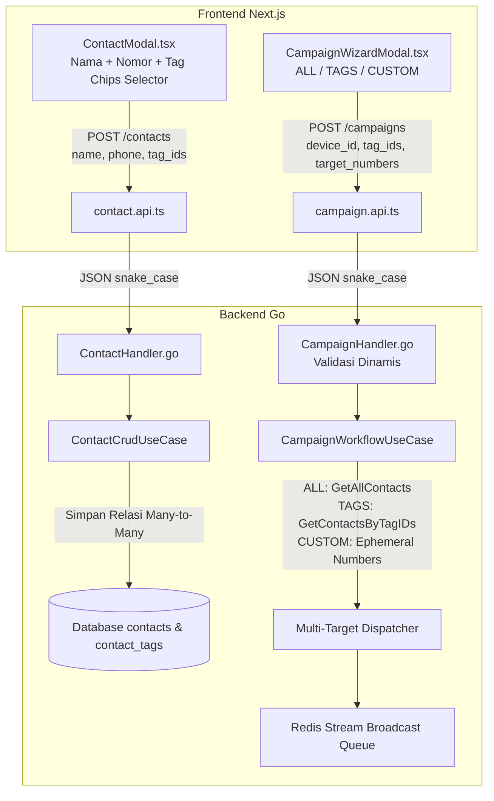

# 🏷️ Rencana Arsitektur & Implementasi: Integrasi Tag Kontak & Resolusi Peluncuran Kampanye Broadcast

Dokumen perencanaan ini merinci arsitektur hulu-ke-hilir untuk:
1. **Fitur Tag & Segmentasi Kontak** di menu `/contacts` (Frontend UI, Hooks, API, hingga Backend DB).
2. **Perbaikan Error 'Validation failed' pada Peluncuran Kampanye** di menu `/campaigns` (Multi-Target: `ALL`, `TAGS`, `CUSTOM`).

---

## 1. 📌 Latar Belakang & Identifikasi Masalah

Saat ini terdapat dua masalah yang saling berkaitan:
1. **Ketiadaan UI Tag di Modal Kontak**:
   * Backend Go sudah memiliki tabel `tags`, pivot `contact_tags`, serta endpoint CRUD tag lengkap (`GET /contacts/tags`, `POST /contacts/tags`, `DELETE /contacts/tags/:id`).
   * Namun di modal tambah/edit kontak frontend ([`ContactModal.tsx`](file:///g:/WEB2026/fontwahide/src/modules/contact/components/modals/ContactModal.tsx)), kolom input tag belum dibuat, dan daftar tag di hook kontak masih di-hardcode kosong (`allTags: [] as string[]`).
   * Akibatnya, kontak tersimpan tanpa tag dan opsi broadcast *"Berdasarkan Tag"* di `/campaigns` menjadi kosong.
2. **Error 'Validation failed' saat Peluncuran Kampanye**:
   * Backend mewajibkan `TagIDs` terisi minimal 1 (`validate:"required,min=1"`).
   * Ketika pengguna broadcast ke nomor manual (`CUSTOM`) atau seluruh kontak (`ALL`), backend menolak request karena `tag_ids` kosong.
   * Format JSON yang dikirim frontend masih `camelCase` (`deviceId`, `messageTemplate`), sementara backend mencari `snake_case` (`device_id`, `message_template`).

---

## 2. 🏛️ Solusi Arsitektur



---

## 3. 🛠️ Detail Spesifikasi Perubahan File

### BAGIAN A: Integrasi Tag Kontak di Frontend (`fontwahide`)

#### 1. [`src/modules/contact/types/contact.types.ts`](file:///g:/WEB2026/fontwahide/src/modules/contact/types/contact.types.ts)
* Tambahkan interface `Tag`:
  ```ts
  export interface Tag {
    id: string;
    tenant_id: string;
    name: string;
    createdAt?: string;
  }
  ```
* Perbarui `CreateContactInput` & `UpdateContactInput`:
  ```ts
  export interface CreateContactInput {
    name: string;
    phone: string;
    tag_ids?: string[];
    tags?: string[];
  }
  ```

#### 2. [`src/modules/contact/api/contact.api.ts`](file:///g:/WEB2026/fontwahide/src/modules/contact/api/contact.api.ts)
* Tambahkan method API untuk mengambil dan membuat tag:
  ```ts
  getTags: async (): Promise<Tag[]> => {
    const res = await httpClient.get<Tag[]>(`${CONTACT_BASE}/contacts/tags`);
    return res.payload || (Array.isArray(res) ? res : []);
  },
  createTag: async (name: string): Promise<Tag> => {
    const res = await httpClient.post<Tag>(`${CONTACT_BASE}/contacts/tags`, { name });
    return res.payload || (res as unknown as Tag);
  },
  deleteTag: async (id: string): Promise<void> => {
    await httpClient.delete(`${CONTACT_BASE}/contacts/tags/${id}`);
  }
  ```
* Pastikan `createContact` memetakan `tag_ids: payload.tag_ids || payload.tags || []`.

#### 3. [`src/modules/contact/hooks/useContacts.ts`](file:///g:/WEB2026/fontwahide/src/modules/contact/hooks/useContacts.ts)
* Tambahkan state `tags: Tag[]` dan fungsi `fetchTags()`.
* Tambahkan fungsi `createTag(name: string)`.
* Kembalikan `allTags: tags.map(t => t.name)` dan objek `tags` ke consumer UI, menggantikan `allTags: [] as string[]`.

#### 4. [`src/modules/contact/components/modals/ContactModal.tsx`](file:///g:/WEB2026/fontwahide/src/modules/contact/components/modals/ContactModal.tsx)
* Tambahkan bagian pemilih tag di bawah input nomor WhatsApp:
  1. **Tag Chip Selector**: Menampilkan seluruh tag yang tersedia. Klik untuk memilih/membatalkan (toggle chip aktif).
  2. **Inline Add Tag**: Input kecil dan tombol `+` untuk membuat tag baru secara langsung tanpa perlu berpindah halaman.
  3. Mengirimkan `tag_ids: selectedTagIds` saat submit.

#### 5. [`src/modules/contact/components/list/ContactTable.tsx`](file:///g:/WEB2026/fontwahide/src/modules/contact/components/list/ContactTable.tsx)
* Tampilkan badge warna tag pada kolom kontak di tabel utama agar status segmentasi kontak terlihat jelas.

---

### BAGIAN B: Peluncuran Kampanye Broadcast (Multi-Target & Auto-Start)

#### 1. [`src/modules/campaign/api/campaign.api.ts`](file:///g:/WEB2026/fontwahide/src/modules/campaign/api/campaign.api.ts)
* Serialisasi payload dari camelCase ke snake_case API standar:
  ```ts
  createCampaign: async (input: CreateCampaignInput): Promise<Campaign> => {
    let tagIDs: string[] = [];
    if (input.targetType === "ALL") {
      tagIDs = ["ALL"];
    } else if (input.targetType === "TAGS" && input.targetTags) {
      tagIDs = input.targetTags;
    } else if (input.targetType === "CUSTOM" && input.targetNumbers) {
      tagIDs = input.targetNumbers.map((num) => `phone:${num}`);
    }

    const payload = {
      device_id: input.deviceId,
      name: input.name,
      message_template: input.messageTemplate,
      target_type: input.targetType,
      tag_ids: tagIDs,
      target_numbers: input.targetNumbers,
      jitter_delay_seconds: input.jitterDelaySeconds,
      enable_human_typing: input.enableHumanTyping,
      scheduled_at: input.scheduledAt || null,
    };

    const res = await httpClient.post<Campaign>(`${CAMPAIGN_BASE}/campaigns`, payload);
    return res.payload || (res as unknown as Campaign);
  }
  ```

#### 2. [`src/modules/campaign/hooks/useCampaigns.ts`](file:///g:/WEB2026/fontwahide/src/modules/campaign/hooks/useCampaigns.ts)
* Saat kampanye dibuat tanpa jadwal waktu (`!data.scheduledAt`), otomatis panggil `campaignApi.startCampaign(newCampaign.id)` agar kampanye langsung aktif (`RUNNING`).

#### 3. Backend Go DTO ([`campaign_dto.go`](file:///g:/WEB2026/wahide/internal/modules/campaign/domain/dto/campaign_dto.go))
* Lepas aturan kaku `validate:"required,min=1"` pada `TagIDs`.
* Tambahkan field `TargetType`, `TargetNumbers`, `JitterDelaySeconds`, `EnableHumanTyping`.

#### 4. Backend Go Handler ([`campaign_handler.go`](file:///g:/WEB2026/wahide/internal/modules/campaign/delivery/http/campaign_handler.go))
* Validasi kondisional:
  - Jika `ALL`: `TagIDs = ["ALL"]`.
  - Jika `CUSTOM`: validasi `len(TargetNumbers) > 0`, isi `TagIDs` dengan nomor ber-prefix `phone:`.
  - Jika `TAGS`: validasi `len(TagIDs) > 0`.

#### 5. Backend Go Workflow ([`campaign_workflow_usecase.go`](file:///g:/WEB2026/wahide/internal/modules/campaign/usecase/campaign_workflow_usecase.go))
* Ekstrak target audiens secara cerdas:
  - `ALL`: ambil seluruh kontak tenant melalui method baru `GetAllContacts`.
  - `phone:xxx`: buat objek kontak *ephemeral* untuk nomor manual.
  - `Tag IDs`: ambil dari `GetContactsByTagIDs`.
  - Deduplikasi nomor telepon target dengan map `seenPhones[phone]` agar tidak ada penerima ganda.

---

## 4. 📋 Rencana Pengujian & Verifikasi

1. **Uji Buat Tag & Kontak**:
   * Buka modal *Add New Contact*.
   * Buat tag baru (misal: `VIP`) langsung di dalam modal.
   * Simpan kontak baru dengan tag tersebut.
   * Pastikan kontak tersimpan di tabel dengan badge `VIP`.
2. **Uji Broadcast Berdasarkan Tag**:
   * Buat kampanye di `/campaigns` dengan target *By Contact Tags*.
   * Tag `VIP` yang tadi dibuat akan muncul di pilihan audiens.
3. **Uji Broadcast Nomor Manual (Custom Numbers)**:
   * Buat kampanye dengan memasukkan nomor `6287711301818`.
   * Klik *Launch Campaign*.
   * Verifikasi: Tidak ada error `Validation failed`, kampanye berhasil dibuat dan langsung berjalan (`RUNNING`).
4. **Quality Gate**:
   * Go: `go vet ./internal/modules/campaign/... ./internal/modules/contact/...`
   * TypeScript: `bun x tsc --noEmit`
   * ESLint: `bun run lint`
   * Prettier: `bun run format`
