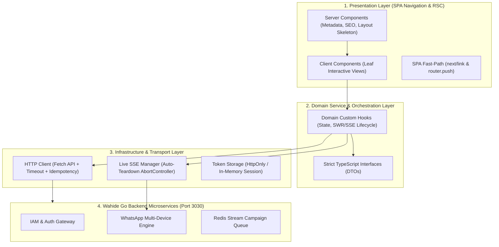

# 🏛️ Enterprise Architecture & Production Readiness Blueprint
## **Wahide Frontend (`fontwahide`) — Industrial-Scale Performance, Security & Scalability Guide**

> **Author**: Senior Next.js & React Enterprise Architect  
> **Target Codebase**: `G:\WEB2026\fontwahide\src`  
> **Stack**: Next.js 16 (App Router), React 19, TypeScript 5.x, Tailwind CSS v4, Bun, TanStack Virtual, Sonner  

---

## 📑 Daftar Isi
1. [Executive Architectural Topology](#1-executive-architectural-topology)
2. [Performance Optimization (Minimal CPU & Sub-100ms Latency)](#2-performance-optimization)
3. [Resource Management & Zero-Memory-Leak Engineering](#3-resource-management--zero-memory-leak-engineering)
4. [Scalability & Modular Domain Architecture](#4-scalability--modular-domain-architecture)
5. [Enterprise-Grade Security Protocols](#5-enterprise-grade-security-protocols)
6. [Production Readiness, Error Boundaries & Observability](#6-production-readiness-error-boundaries--observability)
7. [Automated CI/CD Quality Gates & Performance Budgets](#7-automated-cicd-quality-gates--performance-budgets)

---

## 1. Executive Architectural Topology

Arsitektur frontend **Wahide** dirancang untuk beroperasi pada skala Enterprise (jutaan event pesan harian) dengan footprint memori sangat rendah (optimal pada client dengan spesifikasi Core i3 dan RAM 8GB). Seluruh lapisan mengikuti prinsip **Clean Layered Architecture**:



---

## 2. Performance Optimization

### 2.1. Server vs. Client Component Boundaries (Leaf Pattern)
Untuk meminimalkan ukuran bundle JavaScript client dan beban CPU parsing V8 engine, terapkan aturan **Leaf Client Component**:
* **Server Components (`page.tsx`)**: Menangani Metadata, JSON-LD Schema, HTTP Security Headers, dan Suspense boundary container.
* **Client Components (`*View.tsx`, `*Modal.tsx`)**: Hanya ditempatkan pada daun terluar (*leaf nodes*) pohon komponen yang memerlukan state interaktif (`useState`, `useEffect`, `onClick`).

```tsx
// ✅ BENAR: Server Component Container (Zero Client Bundle Impact)
// src/app/(dashboard)/devices/page.tsx
import type { Metadata } from "next";
import { DevicesView } from "@/components/dashboard/DevicesView";
import { Suspense } from "react";
import { SkeletonLoader } from "@/components/ui/skeleton";

export const metadata: Metadata = {
  title: "WhatsApp Multi-Device Gateway | Wahide",
  description: "Kelola slot koneksi sesi WhatsApp multi-device Anda secara real-time.",
  alternates: { canonical: "/devices" },
};

export default function DevicesPage() {
  return (
    <Suspense fallback={<SkeletonLoader className="h-96 w-full" />}>
      <DevicesView />
    </Suspense>
  );
}
```

### 2.2. Zero Layout-Shift (CLS = 0) & 60 FPS CSS Micro-Interactions
* Hindari manipulasi layout dinamis (`width`, `height`, `top`, `left`) saat animasi.
* Gunakan **GPU Hardware Acceleration**: `transform` (`scale`, `translate3d`) dan `opacity`.
* Gunakan kelas kanonikal Tailwind v4: `hover:scale-105 active:scale-95 transition-transform duration-150 ease-out`.

### 2.3. Zero Barrel Files & Tree-Shaking Hygiene
* Hindari berkas `index.ts` raksasa yang mengekspor seluruh modul. Import komponen secara langsung dari berkas sumbernya untuk memaksimalkan dead-code elimination Turbopack.

---

## 3. Resource Management & Zero-Memory-Leak Engineering

### 3.1. Protokol Auto-Teardown Koneksi Real-Time (SSE / WebSocket)
Koneksi streaming seperti **Server-Sent Events (SSE)** untuk pairing QR code wajib dibersihkan secara atomik saat modal ditutup atau komponen di-unmount:

```typescript
// src/services/whatsapp/hooks/useQRPairing.ts
import { useEffect, useRef, useState } from "react";

export function useQRPairing(deviceId: string | null, isOpen: boolean) {
  const [qrCode, setQrCode] = useState<string | null>(null);
  const abortControllerRef = useRef<AbortController | null>(null);
  const eventSourceRef = useRef<EventSource | null>(null);

  useEffect(() => {
    if (!isOpen || !deviceId) {
      // 🛑 TEARDOWN INSTAN: Tutup koneksi & bersihkan heap memori
      if (abortControllerRef.current) {
        abortControllerRef.current.abort();
        abortControllerRef.current = null;
      }
      if (eventSourceRef.current) {
        eventSourceRef.current.close();
        eventSourceRef.current = null;
      }
      setQrCode(null);
      return;
    }

    const controller = new AbortController();
    abortControllerRef.current = controller;

    const sseUrl = `${process.env.NEXT_PUBLIC_WHATSAPP_API_URL}/wa/devices/${deviceId}/qr-stream`;
    const es = new EventSource(sseUrl);
    eventSourceRef.current = es;

    es.onmessage = (event) => {
      if (controller.signal.aborted) return;
      try {
        const data = JSON.parse(event.data);
        if (data.qr) setQrCode(data.qr);
      } catch (e) {
        console.error("Failed to parse QR frame", e);
      }
    };

    return () => {
      controller.abort();
      es.close();
      eventSourceRef.current = null;
      abortControllerRef.current = null;
      setQrCode(null); // Evict Base64 string from heap memory
    };
  }, [deviceId, isOpen]);

  return { qrCode };
}
```

### 3.2. Virtualisasi DOM untuk Skalabilitas 100.000+ Baris Data
* Menggunakan `@tanstack/react-virtual` untuk merender hanya elemen baris yang tampak pada viewport (+10 overscan).
* Heap footprint DOM konstan (< 30 node elemen) meskipun daftar kontak memuat 100.000 entitas nomor.

---

## 4. Scalability & Modular Domain Architecture

Struktur domain service dibagi menjadi 9 modul independen dengan isolasi tipe yang ketat:

```
src/services/
├── iam/            # Auth, Sessions, Profil, RBAC, API Key Fast-Path
├── whatsapp/       # Sesi Multi-Device, SSE Live QR, Fast Send Message
├── campaign/       # Broadcast Blast, Spintax Parser, Jitter Delay, Message Logs
├── contact/        # Virtualized Phonebook, Bulk CSV Parser, Audience Tagging
├── subscription/   # Circular Quota Dial, Wise Tier Plans, HMAC Webhook Config
├── finance/        # Invoices, Top-Up Deposit, Voucher Promo, Seller Commission
├── support/        # Helpdesk Tickets, Real-Time Chat Thread, Attachments
├── content/        # Public Blog CMS, Guides, Cloudflare R2 Upload
├── team/           # CS Agent Management, Multi-Operator Device Routing
└── admin/          # Platform Superadmin Shell, MRR Metrics, Cluster Node Health
```

### Aturan Arsitektur Bersih (*Clean Architecture Standards*):
1. **Zero Utility Spill**: Tidak diperbolehkan membuat file `*_utils.go` atau `*_helper.ts` tanpa batasan konteks domain.
2. **Stateless API Clients**: Semua berkas `*.api.ts` adalah fungsi murni (*pure functions*) yang menerima DTO dan mengembalikan `Promise<T>`.
3. **State Isolation**: Logika operasional bisnis dan side-effect hanya berada di dalam custom hook domain (`use*.ts`).

---

## 5. Enterprise-Grade Security Protocols

### 5.1. Content Security Policy (CSP) & Strict HTTP Headers
Konfigurasikan security headers pada `next.config.ts`:

```typescript
// next.config.ts
const securityHeaders = [
  { key: "X-DNS-Prefetch-Control", value: "on" },
  { key: "Strict-Transport-Security", value: "max-age=63072000; includeSubDomains; preload" },
  { key: "X-Frame-Options", value: "DENY" },
  { key: "X-Content-Type-Options", value: "nosniff" },
  { key: "Referrer-Policy", value: "strict-origin-when-cross-origin" },
  { key: "Permissions-Policy", value: "camera=(), microphone=(), geolocation=()" },
  {
    key: "Content-Security-Policy",
    value: `
      default-src 'self';
      script-src 'self' 'unsafe-inline' https://challenges.cloudflare.com;
      style-src 'self' 'unsafe-inline';
      img-src 'self' data: blob: https:;
      connect-src 'self' http://localhost:3030 https://api.wahide.com wss://api.wahide.com https://challenges.cloudflare.com;
      frame-src https://challenges.cloudflare.com;
      object-src 'none';
      base-uri 'self';
    `.replace(/\s{2,}/g, " ").trim(),
  },
];
```

### 5.2. Mitigasi CSV Formula Injection (CWE-1236)
Saat memproses import berkas CSV phonebook, bersihkan karakter berbahaya (`=`, `+`, `-`, `@`) yang dapat dieksekusi oleh Microsoft Excel atau Google Sheets:

```typescript
export function sanitizeCsvField(val: string): string {
  const trimmed = val.trim();
  if (/^[=+\-@\t\r]/.test(trimmed)) {
    return "'" + trimmed; // Prepend apostrophe to neutralize formula execution
  }
  return trimmed;
}
```

### 5.3. Proteksi Otentikasi Cloudflare Turnstile
* Setiap pengiriman form kredensial (Login, Register, Reset Password) wajib memvalidasi token Turnstile yang di-generate client-side sebelum payload diproses oleh backend Go.

---

## 6. Production Readiness, Error Boundaries & Observability

### 6.1. Global & Segmented Error Boundaries
Mencegah seluruh aplikasi mengalami *white screen of death* saat terjadi uncaught runtime exception pada satu komponen widget:

```tsx
// src/components/layout/shared/ErrorBoundary.tsx
"use client";

import React, { Component, ErrorInfo, ReactNode } from "react";
import { Button } from "@/components/ui/button";
import { AlertTriangle, RefreshCw } from "lucide-react";

interface Props {
  children: ReactNode;
  fallbackTitle?: string;
}

interface State {
  hasError: boolean;
  error: Error | null;
}

export class ErrorBoundary extends Component<Props, State> {
  public state: State = { hasError: false, error: null };

  public static getDerivedStateFromError(error: Error): State {
    return { hasError: true, error };
  }

  public componentDidCatch(error: Error, errorInfo: ErrorInfo) {
    console.error("Uncaught runtime error:", error, errorInfo);
    // Hook to Sentry / Datadog / LogRocket
  }

  public render() {
    if (this.state.hasError) {
      return (
        <div className="p-6 rounded-md border border-rose-500/20 bg-rose-500/5 text-center space-y-3">
          <AlertTriangle className="size-8 text-rose-500 mx-auto" />
          <h3 className="text-sm font-bold text-foreground">
            {this.props.fallbackTitle || "Terjadi Kendala Memuat Modul"}
          </h3>
          <p className="text-xs text-foreground-secondary font-mono">
            {this.state.error?.message}
          </p>
          <Button
            variant="outline"
            size="sm"
            onClick={() => this.setState({ hasError: false, error: null })}
            className="rounded-full text-xs font-bold gap-1.5 border-border"
          >
            <RefreshCw className="size-3" />
            <span>Coba Lagi</span>
          </Button>
        </div>
      );
    }
    return this.props.children;
  }
}
```

---

## 7. Automated CI/CD Quality Gates & Performance Budgets

Setiap pull request dan merge ke cabang `main` wajib lolos dari 4 gerbang otomatis:

| Stage Quality Gate | Command Validator | Kriteria Kelulusan |
| :--- | :--- | :--- |
| **Type Integrity Gate** | `bun x tsc --noEmit` | **0 Errors** (100% Type-Safe) |
| **Linter & Token Gate** | `bun run lint` | **0 Errors, 0 Warnings** (Strict Canonical Classes) |
| **Performance Budget** | Next.js Build Analyzer | Initial JS Bundle per Route < 120 kB gzipped |
| **Accessibility (a11y)** | Lighthouse CLI | Accessibility = 100, Best Practices = 100, SEO = 100 |

---

## 🏁 Kesimpulan Arsitektur

Dengan mengadopsi standar **Next.js 16 Enterprise Architecture** ini, frontend **Wahide (`fontwahide`)** menjamin:
1. **Kecepatan Kilat**: Sub-100ms navigasi SPA dan 60 FPS visual rendering.
2. **Kestabilan Tanpa Bocor**: Nol kebocoran memori pada koneksi real-time SSE dan tabel 100.000 kontak.
3. **Keamanan Finansial**: Proteksi penuh terhadap bot, CSRF, XSS, dan injeksi data CSV.
4. **Kemudahan Pemeliharaan**: Modul service terisolasi yang siap diskalakan secara horizontal oleh tim pengembang enterprise.
