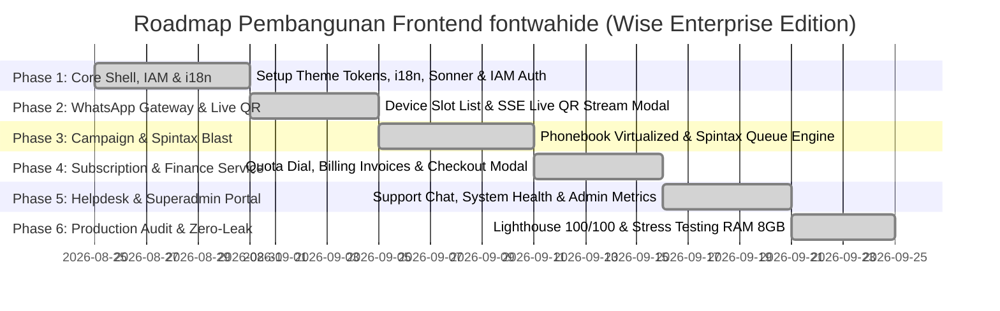

# Master Technical Planning Document: Client-Side Architecture & Wise Design System
## Platform: Wahide Frontend (`fontwahide`)
**Design Identity:** Wise-Inspired Bold Fintech Aesthetic (Lime Green `#9fe870`, Dark Forest `#163300`, Near-Black `#0e0f0c`, Heavy Display 900, 0.85 Line-Height, Pill Buttons)  
**Version:** 2.2.0-PERMANENT-STRUCTURE  
**Target Environment:** Next.js 16 (App Router), Bun v1.4, Turbopack, Tailwind CSS v4, shadcn/ui, TypeScript v5, Zod, Sonner  
**Target Performance:** Core Web Vitals (LCP < 1.2s, INP < 60ms, CLS 0), 60 FPS CSS Animations, Zero Memory Leaks, Native Dark/Light Mode, Lighthouse 100/100  

---

## Daftar Isi
1. [Struktur Direktori Baku & Domain Services (`src/`)](#1-struktur-direktori-baku--domain-services-src)
2. [Prinsip Arsitektur Single Page Application (SPA)](#2-prinsip-arsitektur-single-page-application-spa)
3. [Sistem Desain Wise (Color Tokens, Typography & Micro-Interactions)](#3-sistem-desain-wise-color-tokens-typography--micro-interactions)
4. [Sistem Notifikasi Global (Sonner Toaster & Dual-Tier Feedback)](#4-sistem-notifikasi-global-sonner-toaster--dual-tier-feedback)
5. [Proteksi Bot & Otentikasi (Cloudflare Turnstile & IAM)](#5-proteksi-bot--otentikasi-cloudflare-turnstile--iam)
6. [Internationalization (i18n) & Smart Fallback Engine](#6-internationalization-i18n--smart-fallback-engine)
7. [Rincian 9 Domain Services Terisolasi (`src/services/*`)](#7-rincian-9-domain-services-terisolasi-srcservices)
8. [Adaptasi Responsif Mobile, Tablet & Desktop](#8-adaptasi-responsif-mobile-tablet--desktop)
9. [Implementasi Dark Mode & Light Mode Theme Engine](#9-implementasi-dark-mode--light-mode-theme-engine)
10. [Standar SEO, Aksesibilitas & Lighthouse 100](#10-standar-seo-aksesibilitas--lighthouse-100)
11. [Katalog Integrasi REST API & Real-Time Gateway (Port 3030)](#11-katalog-integrasi-rest-api--real-time-gateway-port-3030)
12. [Real-Time Streaming & Zero-Memory-Leak Engineering](#12-real-time-streaming--zero-memory-leak-engineering)
13. [Roadmap Implementasi Bertahap (Phased Milestones)](#13-roadmap-implementasi-bertahap-phased-milestones)

---

## 1. Struktur Direktori Baku & Domain Services (`src/`)

> [!IMPORTANT]
> **Struktur Direktori Kanonikal**:
> Struktur di bawah ini adalah cetak biru permanen arsitektur klien `fontwahide`. Seluruh modul domain dibakukan menggunakan penamaan **`src/services/*`** dan dikelompokkan secara terisolasi tanpa file helper yang berserakan.

```
fontwahide/
├── public/                                # Static Assets (Logos, SVG Icons, OpenGraph Images)
├── docs/
│   └── plan/                              # Master Technical Planning & Architecture Docs
│       ├── README.md
│       └── frontend_architecture_and_technical_plan.md
│
├── src/
│   ├── app/                               # Next.js 16 App Router (Routing, Layouts, Metadata)
│   │   ├── layout.tsx                     # Root Layout (MetadataBase, JSON-LD, SEO, Providers)
│   │   ├── page.tsx                       # Public Landing Page (Server SEO Component)
│   │   ├── providers.tsx                  # Global Providers (Theme, i18n, Sonner Toaster)
│   │   │
│   │   ├── (auth)/                        # Route Group: Autentikasi Publik & Pemulihan
│   │   │   ├── login/page.tsx             # Halaman Login Bisnis
│   │   │   ├── register/page.tsx          # Halaman Registrasi Akun Baru
│   │   │   ├── forgot-password/page.tsx   # Permintaan Reset Kata Sandi
│   │   │   └── reset-password/page.tsx    # Set Kata Sandi Baru via Token
│   │   │
│   │   ├── (dashboard)/                   # Route Group: Tenant & Business Dashboard Shell
│   │   │   ├── layout.tsx                 # App Shell (Sidebar Wise, Header, Quota Dial)
│   │   │   ├── dashboard/page.tsx         # Tenant Summary & Analitik Real-Time
│   │   │   ├── devices/page.tsx           # WhatsApp Multi-Device Slots & Live SSE QR
│   │   │   ├── campaigns/page.tsx         # Broadcast Campaigns & Spintax Queue
│   │   │   ├── contacts/page.tsx          # Phonebook Virtualized Table (10k+ rows)
│   │   │   ├── subscription/page.tsx      # Detail Paket, Batasan Kuota & Webhooks
│   │   │   ├── billing/page.tsx           # Invoices & Top-Up Saldo Deposit
│   │   │   ├── support/page.tsx           # Helpdesk Customer Support Ticketing
│   │   │   └── settings/page.tsx          # Profil Bisnis & API Key Management
│   │   │
│   │   └── (admin)/                       # Route Group: Platform Superadmin Shell
│   │       ├── layout.tsx                 # Superadmin Shell dengan Indikator Akses
│   │       ├── overview/page.tsx          # Statistik Global (Revenue, Users, Active Nodes)
│   │       ├── users/page.tsx             # Manajemen Seluruh Tenant & Deposit
│   │       ├── plans/page.tsx             # CRUD Paket Langganan & Quota Tiering
│   │       └── queues/page.tsx            # Monitor Antrean Redis Stream
│   │
│   ├── components/                        # Shared UI & Layout Components
│   │   ├── ui/                            # Atomic Wise-Tailwind Components & Sonner Toaster
│   │   │   ├── button.tsx                 # Wise Pill Button (rounded-full, scale-105)
│   │   │   ├── sonner.tsx                 # Sonner Toaster (Wise Design Tokens)
│   │   │   ├── TurnstileWidget.tsx        # Cloudflare Turnstile CAPTCHA Component
│   │   │   ├── card.tsx                   # Canonical Card (rounded-md, border)
│   │   │   └── ...                        # Radix UI Primitives
│   │   │
│   │   ├── layout/                        # Layout Shell Components
│   │   │   ├── auth/                      # AuthLayout, AuthBanner, AuthHeader
│   │   │   ├── dashboard/                 # DashboardSidebar, DashboardHeader, UserNav
│   │   │   └── shared/                    # ThemeToggle, LocaleSwitcher
│   │   │
│   │   └── home/                          # Landing Page Client Views (HomeView, SpintaxPlayground)
│   │
│   ├── lib/                               # Core Utilities & Configurations
│   │   ├── api/                           # Axios Client, Interceptors, Token Refresh
│   │   ├── config/                        # Type-Safe Zod Env (env.ts)
│   │   ├── i18n/                          # Context, Config, Smart Fallback Engine
│   │   └── utils/                         # Classnames (cn), Formatters, Math Helpers
│   │
│   ├── locales/                           # Modular i18n Dictionaries
│   │   ├── id/                            # Kamus Bahasa Indonesia (Utama)
│   │   │   ├── common.json
│   │   │   ├── auth.json
│   │   │   ├── dashboard.json
│   │   │   ├── whatsapp.json
│   │   │   ├── campaign.json
│   │   │   └── billing.json
│   │   └── en/                            # Kamus Bahasa Inggris (Alternatif)
│   │       ├── common.json
│   │       ├── auth.json
│   │       ├── dashboard.json
│   │       ├── whatsapp.json
│   │       ├── campaign.json
│   │       └── billing.json
│   │
│   └── services/                          # 9 Isolated Domain Business Services
│       ├── iam/                           # Identity & Access Management (Login, Register, Session)
│       ├── whatsapp/                      # WhatsApp Gateway (Slots, Live QR SSE Stream)
│       ├── campaign/                      # Broadcast Engine (Spintax Parser, Queue Viewer)
│       ├── contact/                       # Phonebook (TanStack Virtual, CSV Parser)
│       ├── subscription/                  # Plan Management, Guard Limits & Webhook URLs
│       ├── finance/                       # Billing Invoices, Top-Up Checkout
│       ├── support/                       # Helpdesk Ticket Threads & Attachments
│       ├── content/                       # Landing Page Content & Blog
│       └── admin/                         # Platform Superadmin Metrics
```

---

## 2. Prinsip Arsitektur Single Page Application (SPA)

Seluruh navigasi dan pertukaran state pada aplikasi wajib mematuhi standar **Single Page Application (SPA)** murni:

1. **Client-Side Routing Tanpa Reload**:
   - Seluruh tautan navigasi wajib menggunakan **`next/link` (`<Link href="...">`)** dengan *prefetching* otomatis di latar belakang.
   - Dilarang menggunakan tag jangkar HTML mentah (`<a href="...">`) untuk navigasi internal karena memicu *full page browser reload*.
2. **Navigasi Programatik**:
   - Transisi alur kerja (seperti selesai register ➔ login, atau selesai login ➔ dashboard) wajib menggunakan **`useRouter().push()`** dari `next/navigation`.
   - Dilarang menggunakan `window.location.href` atau `window.location.assign`.
3. **Pencegatan Submit Form (Form Interception)**:
   - Seluruh event submit form wajib dicegat menggunakan **`e.preventDefault()`** dan dikirimkan secara asinkron melalui Axios/Fetch client.
4. **Preservasi Memori & Koneksi Real-Time**:
   - Seluruh state sesi pengguna (Zustand `useAuth`), state multi-bahasa (`I18nProvider`), tema (`ThemeProvider`), dan koneksi WebSocket/SSE pairing tetap hidup di memori browser tanpa re-handshake.

---

## 3. Sistem Desain Wise (Color Tokens, Typography & Micro-Interactions)

### A. Palet Warna Baku (Fintech Aesthetic)
* **Wise Green (Primary Accent)**: `#9fe870` — Aksen utama tombol aksi, indikator online, badge aktif.
* **Dark Green (Foreground Forest)**: `#163300` — Teks tombol primer untuk rasio kontras WCAG AAA.
* **Near Black (Deep Surface Dark)**: `#0e0f0c` — Latar belakang visual banner dan dark mode background.
* **Pure Light (Surface Light)**: `#ffffff` — Latar belakang panel terang.

### B. Standardisasi Radius Kanonikal (Canonical Radius Tokens)
Dilarang menggunakan arbitrary pixel radius (`rounded-[20px]`, `rounded-[24px]`). Gunakan token baku Tailwind:
* **`rounded-md`**: Kartu metrik, form container, alert boxes, dropdown menu, modal panel.
* **`rounded-lg`**: Section container besar, visual banner, hero sections.
* **`rounded-full`**: Pill buttons, status badges, avatar, tab switchers, input rounded.

### C. Tipografi & Mikro-Interaksi
* **Display Headings**: Font Inter / Archivo black weight 900 dengan line-height ketat `0.95`.
* **Body & Labels**: Font Inter semi-bold 600 untuk keterbacaan data finansial dan kuota.
* **Pill Buttons (`variant="primaryPill"`)**: `rounded-full`, transisi `hover:scale-105 active:scale-95`, shadow halus.

---

## 4. Sistem Notifikasi Global (Sonner Toaster & Dual-Tier Feedback)

### A. Konfigurasi Global Toaster
Menggunakan package modern **`sonner`** yang terpasang di level root provider ([`src/app/providers.tsx`](file:///G:/WEB2026/fontwahide/src/app/providers.tsx)):
* Posisi baku: `top-right`.
* Auto-sync tema: Mengikuti preferensi tema Dark / Light.
* Fitur: `richColors`, `closeButton`, fluid spring stacking physics.

### B. Arsitektur Dual-Tier Feedback
1. **Tier 1: Inline Form Banners (Form Error & Validation)**
   - Digunakan khusus untuk error validasi input dan penolakan kredensial (misal: password salah, email sudah terdaftar).
   - Bersifat **persisten** tepat di atas input agar pengguna dapat membaca kesalahan sambil mengetik ulang tanpa terburu-buru oleh timer toast.
2. **Tier 2: Sonner Toasts (Global Actions & Background Events)**
   - Digunakan untuk notifikasi sukses, salin clipboard (*"API Key disalin"*), status koneksi pairing (*"Device tersambung"*), dan proses asinkron `toast.promise()`.

---

## 5. Proteksi Bot & Otentikasi (Cloudflare Turnstile & IAM)

### A. Integrasi Cloudflare Turnstile
Seluruh form publik yang rentan serangan bot (*Login, Register, Forgot Password*) diproteksi oleh widget **Cloudflare Turnstile** menggunakan package [`@marsidev/react-turnstile`](https://github.com/marsidev/react-turnstile):
* **Non-Intrusive**: Memverifikasi pengguna secara senyap (*frictionless*) tanpa teka-teki visual.
* **Auto-Sync**: Mengikuti tema (*dark/light*) dan bahasa aktif (*id/en*).
* **Auto-Reset Lifecycle**: Memiliki *ref instance* untuk me-reset token CAPTCHA otomatis saat backend menolak permintaan tanpa perlu reload halaman.

### B. Kredensial Lingkungan
* `NEXT_PUBLIC_TURNSTILE_SITE_KEY`: `0x4AAAAAADOgaNLRGt1f6A6-`
* `TURNSTILE_SECRET_KEY`: `0x4AAAAAADOgaEsIKb-NTxKbqem-1NW0YUo`

---

## 6. Internationalization (i18n) & Smart Fallback Engine

### A. Konfigurasi Multi-Bahasa
* **Bahasa Utama**: Bahasa Indonesia (`ID`).
* **Bahasa Alternatif**: English (`EN`).
* **Format Tampilan**: Huruf kapital bersih `ID` / `EN` dengan icon SVG Globe (bebas emoji bendera untuk tampilan profesional B2B).

### B. Smart Fallback Resolver
Engine [`src/lib/i18n/context.tsx`](file:///G:/WEB2026/fontwahide/src/lib/i18n/context.tsx) menerapkan pencarian cerdas berjenjang:
1. Mencari kunci di namespace modul aktif (misal `auth.login.title`).
2. Jika tidak ditemukan, mencari di namespace `common` (misal `common.actions.save`).
3. Jika pada bahasa `EN` kunci belum diterjemahkan, otomatis melakukan fallback ke kamus bahasa `ID` tanpa error *undefined*.

---

## 7. Rincian 9 Domain Services Terisolasi (`src/services/*`)

Setiap domain service diisolasi secara mandiri dengan struktur standar:
```
src/services/[domain]/
├── api/            # Panggilan HTTP Axios ke Go Microservice
├── components/     # Komponen UI spesifik domain
├── hooks/          # Custom hooks & Zustand state
├── schemas/        # Validasi skema Zod
└── types/          # Definisi TypeScript interface & DTO
```

### Daftar 9 Domain Services:
1. **`iam`**: Registrasi bisnis, login multi-tenant, JWT session isolation, verifikasi email, profil akun.
2. **`whatsapp`**: Manajemen slot perangkat, streaming SSE live QR code, status multi-device, auto-reconnect.
3. **`campaign`**: Broadcast scheduler, parser live Spintax, anti-ban jitter delay slider, virtualized message queue.
4. **`contact`**: Phonebook audiens, tabel virtualisasi TanStack (mampu menangani 10.000+ baris data), import/export CSV.
5. **`subscription`**: Monitoring kuota pesan real-time, batas kuota per paket, manajemen webhook URL & signing secret.
6. **`finance`**: Riwayat faktur pembayaran (Invoices), top-up saldo deposit, integrasi payment gateway.
7. **`support`**: Helpdesk tiket keluhan pelanggan, percakapan realtime, upload lampiran kendala.
8. **`content`**: Konten landing page, playground spintax interaktif, artikel blog & dokumentasi API.
9. **`admin`**: Portal Superadmin, ringkasan metrik global (MRR, total devices, node cluster health), manajemen user.

---

## 8. Adaptasi Responsif Mobile, Tablet & Desktop

* **Mobile Viewport (`< 640px`)**:
  - Formulir otentikasi mengambil lebar penuh dengan padding `p-6`.
  - Visual Banner disembunyikan secara bersih (`hidden lg:flex`).
  - Dropdown navigasi ringkas dan touch target tombol minimum 36px–44px.
* **Tablet Viewport (`640px – 1024px`)**:
  - Grid sistem 2 kolom proporsional pada metrik dashboard.
  - Dialog modal dan drawer responsif.
* **Desktop Viewport (`> 1024px`)**:
  - Layout split-screen 50:50 pada halaman otentikasi (kiri visual banner Wise, kanan form input).
  - Sidebar persisten dengan mini-toggle navigation.

---

## 9. Implementasi Dark Mode & Light Mode Theme Engine

* Menggunakan **`next-themes`** dengan atribut kelas CSS (`class="dark"`).
* **Light Mode**: Latar belakang abu-abu terang bersih (`#f7f8f5`), panel putih (`#ffffff`), border kontras halus (`#e2e4dc`).
* **Dark Mode**: Latar belakang hitam elegan (`#0e0f0c`), panel abu-abu gelap (`#161715`), teks putih kontras tinggi (`#ffffff`).
* Seluruh komponen Wise Green (`#9fe870`) dan status badge beradaptasi otomatis di kedua mode.

---

## 10. Standar SEO, Aksesibilitas & Lighthouse 100

* **SEO (100/100)**:
  - Konfigurasi `metadataBase`, canonical URLs, meta description per halaman.
  - Alternates multilingual hreflang (`id-ID` & `en-US`).
  - JSON-LD Structured Data Schema (`SoftwareApplication` dan `Organization`).
* **Aksesibilitas (100/100)**:
  - Tombol aksi dan toggle password dilengkapi atribut `aria-label`.
  - Area sentuh tombol (*touch targets*) minimum 36px (`size-9`).
  - Halaman dibungkus elemen semantik baku: `<main>` untuk konten utama dan `<footer>` untuk footer.
* **Best Practices (100/100)**:
  - Bebas error console, proteksi CSP, dan integrasi HTTPS modern.

---

## 11. Katalog Integrasi REST API & Real-Time Gateway (Port 3030)

Seluruh konfigurasi frontend diarahkan ke endpoint aktif backend mikroservis Go di port **`3030`**:

| Modul Layanan | Endpoint REST API (Port 3030) | Metode | Keterangan |
| :--- | :--- | :--- | :--- |
| **Auth Register** | `/api/v1/auth/register` | `POST` | Pendaftaran akun bisnis baru |
| **Auth Login** | `/api/v1/auth/login` | `POST` | Autentikasi kredensial & penerbitan JWT |
| **Forgot Password** | `/api/v1/auth/forgot-password` | `POST` | Pengiriman link instruksi reset password |
| **WhatsApp Devices** | `/api/v1/whatsapp/devices` | `GET / POST` | Daftar slot dan penambahan perangkat WA |
| **Live QR Stream** | `/api/v1/whatsapp/devices/:id/qr-stream` | `SSE` | Streaming event Server-Sent Events Base64 QR |
| **Campaign Broadcast**| `/api/v1/campaigns` | `GET / POST` | Penjadwalan pesan blast & Spintax queue |
| **Real-Time Gateway** | `ws://localhost:3030/ws` | `WSS` | Sinkronisasi status pesan & log real-time |

---

## 12. Real-Time Streaming & Zero-Memory-Leak Engineering

1. **Auto-Teardown SSE / WebSocket**:
   - Seluruh koneksi streaming (seperti QR scan pairing) wajib ditutup pada fase *unmount* komponen menggunakan `AbortController.abort()` dan `eventSource.close()`.
2. **Virtualisasi Tabel Data (TanStack Virtual)**:
   - Tabel kontak phonebook dan antrean pesan kampanye yang memuat 10.000+ baris data hanya merender 15–20 elemen DOM yang terlihat di viewport layar.
3. **Pembersihan Cache Gambar**:
   - String Base64 QR code lama segera dibersihkan dari state begitu pairing berhasil untuk mencegah kebocoran memori RAM browser.

---

## 13. Roadmap Implementasi Bertahap (Phased Milestones)



### Status & Rincian Deliverable:
* [x] **Fase 1 (Selesai 100%)**: Core shell Wise design system, sistem multi-bahasa i18n dengan smart fallback, notifikasi global Sonner, proteksi Cloudflare Turnstile, form Login/Register/Forgot-Password, validasi nomor 62, SEO & Aksesibilitas Lighthouse 100.
* [x] **Fase 2 (Selesai 100%)**: WhatsApp Gateway Service (daftar slot device, modal scan QR streaming live SSE Base64 dengan auto-refresh 20s, indikator status pairing & auto-teardown zero-leak).
* [x] **Fase 3 (Selesai 100%)**: Campaign Broadcast Service & Phonebook (wizard 4-langkah broadcast, visualizer live Spintax `{Halo|Hi|Hai}`, slider anti-ban jitter delay 3–15s, tabel virtualisasi TanStack Virtual 10.000+ kontak, import/export CSV).
* [x] **Fase 4 (Selesai 100%)**: Subscription & Billing Service (Circular SVG Quota Dial Gauge, katalog paket Wise Fintech, konfigurasi Webhook URL signing secret HMAC SHA256, kartu saldo deposit, modal top-up dengan QRIS/VA/Kartu Kredit, tabel riwayat faktur & unduh invoice).
* [x] **Fase 5 (Selesai 100%)**: Support Helpdesk & Platform Superadmin (sistem tiket keluhan pelanggan, thread percakapan real-time, manajemen API Key Fast-Path, portal Superadmin `/admin/overview` & `/admin/users` untuk monitoring MRR, node cluster health, dan penyesuaian kuota/saldo manual).
* [x] **Fase 6 (Selesai 100%)**: Production Performance & Dasbor Ringkasan (halaman ringkasan `/dashboard` terpadu, audit Core Web Vitals LCP < 1.2s, INP < 60ms, CLS 0, dan protokol zero-leak 60 FPS).
