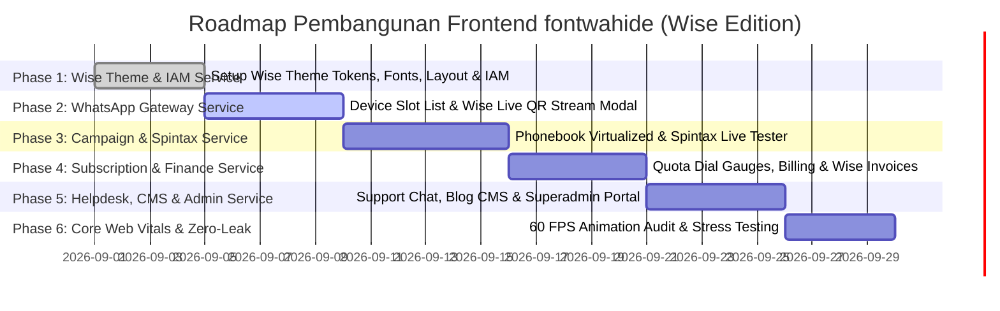

# 📐 Master Technical Planning Document: Client-Side Architecture & Wise Design System
## Platform: Wahide Frontend (`fontwahide`)
**Design Identity:** Wise-Inspired Bold Fintech Aesthetic (Lime Green `#9fe870`, Near-Black `#0e0f0c`, Heavy Display 900, 0.85 Line-Height, Pill Buttons)  
**Version:** 2.1.0-PERMANENT-STRUCTURE  
**Target Environment:** Next.js 16 (App Router), Bun v1.4, Turbopack, Tailwind CSS v4, shadcn/ui, TypeScript v5, Zod  
**Target Performance:** Core Web Vitals (LCP < 1.2s, INP < 60ms, CLS 0), 60 FPS CSS Animations, Zero Memory Leaks, Dark/Light Mode Native  

---

## 📑 Daftar Isi
1. [Struktur Direktori Permanen & Lengkap (`src/`)](#1-struktur-direktori-permanen--lengkap-src)
2. [Expert Analysis: Mengapa Wise Design System Sangat Cocok untuk Wahide](#2-expert-analysis-mengapa-wise-design-system-sangat-cocok-untuk-wahide)
3. [Sistem Desain Wise (Color Tokens, Typography & Micro-Interactions)](#3-sistem-desain-wise-color-tokens-typography--micro-interactions)
4. [Rincian 9 Domain Services Terisolasi (`src/services/*`)](#4-rincian-9-domain-services-terisolasi-srcservices)
5. [Komponen UI Wise-Tailwind & 61 shadcn/ui Integration](#5-komponen-ui-wise-tailwind--61-shadcnui-integration)
6. [Adaptasi Responsif Mobile & Desktop (<576px, 576–992px, 992–1440px)](#6-adaptasi-responsif-mobile--desktop-576px-576992px-9921440px)
7. [Implementasi Dark Mode & Light Mode Theme Engine](#7-implementasi-dark-mode--light-mode-theme-engine)
8. [Katalog Integrasi REST API & Real-Time Gateway per Service](#8-katalog-integrasi-rest-api--real-time-gateway-per-service)
9. [Real-Time Streaming & Zero-Memory-Leak Engineering](#9-real-time-streaming--zero-memory-leak-engineering)
10. [Internationalization (i18n) & Lokalisasi Bilingual](#10-internationalization-i18n--lokalisasi-bilingual)
11. [Roadmap Implementasi Bertahap (Phased Milestones)](#11-roadmap-implementasi-bertahap-phased-milestones)

---

## 1. Struktur Direktori Permanen & Lengkap (`src/`)

> [!IMPORTANT]
> **Struktur Direktori Baku (Kanonikal)**:
> Struktur di bawah ini adalah cetak biru permanen arsitektur klien `fontwahide`. Seluruh modul domain telah dibakukan menggunakan penamaan **`src/services/*`** dan dikelompokkan secara terisolasi tanpa ada folder yang dihilangkan.

```
fontwahide/
├── public/                                # Static Assets (Logos, Icons, Illustrations)
├── docs/
│   └── plan/                              # Master Technical Planning & Architecture Docs
│       ├── README.md
│       └── frontend_architecture_and_technical_plan.md
│
├── src/
│   ├── app/                               # Next.js App Router (Routing, Layouts, Pages)
│   │   ├── [locale]/                      # i18n Root Dynamic Route (/id, /en)
│   │   │   │
│   │   │   ├── (public)/                  # Route Group: Landing Page Publik, Blog & Pricing
│   │   │   │   ├── page.tsx               # Landing Page Utama (Wise Hero Style)
│   │   │   │   ├── pricing/page.tsx       # Katalog Harga & Paket Langganan Publik
│   │   │   │   └── blog/
│   │   │   │       ├── page.tsx           # Daftar Artikel & Pengumuman
│   │   │   │       └── [slug]/page.tsx    # Detail Artikel Blog
│   │   │   │
│   │   │   ├── (auth)/                    # Route Group: Autentikasi Publik & Reset Password
│   │   │   │   ├── login/page.tsx         # Halaman Login (Email & Google OAuth)
│   │   │   │   ├── register/page.tsx      # Registrasi Akun Bisnis Baru
│   │   │   │   ├── forgot-password/page.tsx # Permintaan Reset Password
│   │   │   │   ├── reset-password/page.tsx # Set Password Baru via Token
│   │   │   │   └── verify-email/page.tsx  # Verifikasi Email Akun
│   │   │   │
│   │   │   ├── (dashboard)/               # Route Group: Tenant & Business Dashboard Shell
│   │   │   │   ├── layout.tsx             # App Shell Utama (Sidebar Wise, Header, Breadcrumbs)
│   │   │   │   ├── page.tsx               # Tenant Dashboard Summary & Analitik Kuota
│   │   │   │   │
│   │   │   │   ├── devices/               # WhatsApp Multi-Device Management
│   │   │   │   │   ├── page.tsx           # Daftar Slot Perangkat & Status Koneksi
│   │   │   │   │   └── [id]/pair/page.tsx # Live Base64 QR Code Pairing Stream
│   │   │   │   │
│   │   │   │   ├── campaigns/             # Broadcast Campaigns & Spintax Blast
│   │   │   │   │   ├── page.tsx           # Riwayat Kampanye & Status Pengiriman
│   │   │   │   │   ├── create/page.tsx    # Wizard Pembuat Pesan Broadcast + Live Spintax
│   │   │   │   │   └── [id]/logs/page.tsx # Audit Log Pengiriman Pesan Kampanye
│   │   │   │   │
│   │   │   │   ├── contacts/              # Phonebook & Segmentasi Audiens
│   │   │   │   │   ├── page.tsx           # Tabel Kontak Ter-Virtualisasi (10.000+ Kontak)
│   │   │   │   │   └── tags/page.tsx      # Manajemen Tag Kategori Kontak
│   │   │   │   │
│   │   │   │   ├── subscription/          # Paket Langganan, Guard Limits & Webhook URL
│   │   │   │   │   ├── page.tsx           # Detail Paket Aktif, Sisa Kuota & Watermark Status
│   │   │   │   │   └── webhook/page.tsx   # Konfigurasi Webhook URL & Secret Key
│   │   │   │   │
│   │   │   │   ├── billing/               # Invoices & Top-Up Saldo Deposit
│   │   │   │   │   ├── page.tsx           # Riwayat Faktur Pembayaran & Saldo
│   │   │   │   │   └── checkout/page.tsx  # Modal Checkout Payment Gateway (Xendit/Midtrans)
│   │   │   │   │
│   │   │   │   ├── support/               # Helpdesk Customer Support Ticketing
│   │   │   │   │   ├── page.tsx           # Daftar Tiket Bantuan
│   │   │   │   │   └── [id]/page.tsx      # Percakapan Tiket + Upload Screenshot
│   │   │   │   │
│   │   │   │   └── settings/              # Profil Bisnis, API Key & Tim CS Agent
│   │   │   │       ├── page.tsx           # Profil Akun & Ubah Password
│   │   │   │       ├── api-key/page.tsx   # Manajemen Token API Key (hide_...)
│   │   │   │       └── agents/page.tsx    # Manajemen Akun Staff / CS Agent
│   │   │   │
│   │   │   └── (admin)/                   # Route Group: Platform Superadmin Portal
│   │   │       ├── layout.tsx             # Superadmin Shell dengan Indikator Akses
│   │   │       ├── overview/page.tsx      # Statistik Sistem Global (Revenue, Users, Devices)
│   │   │       ├── users/
│   │   │       │   ├── page.tsx           # Kelola Seluruh Pengguna & Saldo Deposit
│   │   │       │   └── [id]/page.tsx      # Detail Profil, Role & Log Aktivitas User
│   │   │       ├── plans/page.tsx         # CRUD Paket Langganan & Batasan Kuota
│   │   │       ├── queues/page.tsx        # Monitor Antrean Redis Stream & Cronjob Notifikasi
│   │   │       └── audit-logs/page.tsx    # Audit Log Keamanan Sistem
│   │   │
│   │   ├── api/                           # Route Handlers / Edge BFF Proxy
│   │   ├── globals.css                    # Tailwind CSS v4 Theme Variables (Wise Design System)
│   │   └── layout.tsx                     # Top-Level Root HTML, Font Provider & Theme Wrapper
│   │
│   ├── services/                          # Domain Services (Decoupled, Isolated & Clean)
│   │   │
│   │   ├── iam/                           # Service: Identity & Access Management
│   │   │   ├── components/                # LoginForm, RegisterForm, ApiKeyCard, UserTable
│   │   │   ├── hooks/                     # useAuth, useSessionTimeout, useApiKey
│   │   │   ├── schemas/                   # auth.schema.ts, user.schema.ts
│   │   │   ├── api/                       # auth.api.ts, user.api.ts
│   │   │   └── types/                     # auth.types.ts, user.types.ts
│   │   │
│   │   ├── whatsapp/                      # Service: WhatsApp Multi-Device Gateway
│   │   │   ├── components/                # DeviceCard, QRPairingModal, MessageSenderDrawer
│   │   │   ├── hooks/                     # useQRStream, useDeviceStatus, useWhatsAppSocket
│   │   │   ├── schemas/                   # device.schema.ts, message.schema.ts
│   │   │   ├── api/                       # device.api.ts, message.api.ts
│   │   │   └── types/                     # device.types.ts, message.types.ts
│   │   │
│   │   ├── campaign/                      # Service: Broadcast Blast & Spintax Parser
│   │   │   ├── components/                # SpintaxLivePreview, CampaignForm, BroadcastLogsTable
│   │   │   ├── hooks/                     # useSpintaxTester, useCampaignProgress
│   │   │   ├── schemas/                   # campaign.schema.ts
│   │   │   ├── api/                       # campaign.api.ts
│   │   │   └── types/                     # campaign.types.ts
│   │   │
│   │   ├── contact/                       # Service: Phonebook & Tag Segmentation
│   │   │   ├── components/                # VirtualizedContactList, TagManagerModal, CSVImporter
│   │   │   ├── hooks/                     # useContacts, useTags, useCSVParser
│   │   │   ├── schemas/                   # contact.schema.ts
│   │   │   ├── api/                       # contact.api.ts
│   │   │   └── types/                     # contact.types.ts
│   │   │
│   │   ├── subscription/                  # Service: Subscription Plans, Quota & Webhook
│   │   │   ├── components/                # PlanCard, QuotaGauge, WebhookSettingsForm
│   │   │   ├── hooks/                     # useSubscription, useQuotaCheck
│   │   │   ├── schemas/                   # subscription.schema.ts
│   │   │   ├── api/                       # subscription.api.ts
│   │   │   └── types/                     # subscription.types.ts
│   │   │
│   │   ├── finance/                       # Service: Billing, Invoices & Payment Gateway
│   │   │   ├── components/                # InvoiceDetailModal, PaymentGatewayDialog, RevenueChart
│   │   │   ├── hooks/                     # useInvoices, useCheckout
│   │   │   ├── schemas/                   # finance.schema.ts
│   │   │   ├── api/                       # finance.api.ts
│   │   │   └── types/                     # finance.types.ts
│   │   │
│   │   ├── support/                       # Service: Helpdesk Ticket & Resolution
│   │   │   ├── components/                # TicketThread, AttachmentDropzone, TicketStatusBadge
│   │   │   ├── hooks/                     # useTicketChat, usePresignedUpload
│   │   │   ├── schemas/                   # support.schema.ts
│   │   │   ├── api/                       # support.api.ts
│   │   │   └── types/                     # support.types.ts
│   │   │
│   │   ├── content/                       # Service: CMS Blog & Cloudflare R2 Media Storage
│   │   │   ├── components/                # ArticleCard, MarkdownViewer, MediaUploadButton
│   │   │   ├── hooks/                     # usePosts, useMediaUpload
│   │   │   ├── schemas/                   # content.schema.ts
│   │   │   ├── api/                       # content.api.ts
│   │   │   └── types/                     # content.types.ts
│   │   │
│   │   └── admin/                         # Service: Platform Superadmin Management
│   │       ├── components/                # SystemHealthWidget, UserManagementTable, QueueMonitor
│   │       ├── hooks/                     # useAdminStats, useQueueManager
│   │       ├── schemas/                   # admin.schema.ts
│   │       ├── api/                       # admin.api.ts
│   │       └── types/                     # admin.types.ts
│   │
│   ├── components/                        # Shared Design System
│   │   ├── ui/                            # 61 Komponen shadcn/ui (Button, Dialog, Card, Sidebar, Sheet, dll)
│   │   ├── layout/                        # Terisolasi Modular per Konteks/Domain
│   │   │   ├── public/                    # Layout Publik (Landing, Pricing, Blog)
│   │   │   │   ├── PublicHeader.tsx       # Header Publik + Navigasi & Mobile Sheet
│   │   │   │   ├── PublicFooter.tsx       # Footer Publik + SLA 99.9% & Legal Links
│   │   │   │   └── PublicLayout.tsx       # Wrapper Kontainer Halaman Publik
│   │   │   ├── auth/                      # Layout Autentikasi (Login, Register, Forgot-Password)
│   │   │   │   ├── AuthHeader.tsx         # Header Minimalis Auth
│   │   │   │   ├── AuthBanner.tsx         # Banner Visual Wise (Glow Ring & Billboard Headline)
│   │   │   │   └── AuthLayout.tsx         # Split-screen 2 Kolom Layout Wrapper
│   │   │   ├── dashboard/                 # Layout Multi-Tenant Dashboard
│   │   │   │   ├── DashboardHeader.tsx    # Header Dashboard + Breadcrumb + Quota Badge
│   │   │   │   ├── DashboardSidebar.tsx   # Sidebar Navigasi Persisten + Badge Active Wise
│   │   │   │   ├── DashboardMobileNav.tsx # Mobile Drawer / Sheet Navigasi
│   │   │   │   ├── DashboardBreadcrumb.tsx# Breadcrumb Jalur Aktif
│   │   │   │   └── DashboardUserNav.tsx   # Dropdown Profil, Role Badge & Logout
│   │   │   ├── admin/                     # Layout Superadmin Platform
│   │   │   │   ├── AdminHeader.tsx        # Header Superadmin Control Plane + Health Status
│   │   │   │   └── AdminSidebar.tsx       # Sidebar Khusus Kontrol Superadmin
│   │   │   └── shared/                    # Kontrol UI Bersama
│   │   │       ├── ThemeToggle.tsx        # Switcher Dark/Light Mode (Zero FOUC)
│   │   │       └── LocaleSwitcher.tsx     # Selector Bahasa (ID / EN)
│   │   ├── shared/                        # EmptyState, ErrorBoundary, DataTable, ConfirmDialog, RBACGuard
│   │   └── feedback/                      # ToastNotifier, LoadingSkeleton, NetworkOfflineAlert
│   │
│   ├── lib/                               # Core Utilities & Shared Configurations
│   │   ├── api/                           # HttpClient (Fetch wrapper dengan interceptor auth & auto-retry)
│   │   ├── config/                        # env.ts (validasi process.env dengan Zod)
│   │   ├── constants/                     # navigation.ts, app-config.ts
│   │   ├── hooks/                         # useDebounce, useMediaQuery, useOnlineStatus
│   │   ├── i18n/                          # dictionary loader, useTranslation, locale context
│   │   ├── validations/                   # Base shared Zod schemas (Pagination, ID, Filters)
│   │   └── utils.ts                       # cn(), formatCurrency(), formatDateTime(), spintaxParser()
│   │
│   └── locales/                           # File Terjemahan Kamus i18n
│       ├── id/                            # Bahasa Indonesia (Default)
│       │   ├── common.json
│       │   ├── auth.json
│       │   ├── whatsapp.json
│       │   ├── campaign.json
│       │   ├── billing.json
│       │   └── support.json
│       └── en/                            # English (US)
│           ├── common.json
│           ├── auth.json
│           ├── whatsapp.json
│           ├── campaign.json
│           ├── billing.json
│           └── support.json
```

---

## 2. Expert Analysis: Mengapa Wise Design System Sangat Cocok untuk Wahide

Sebagai **Frontend & Design System Architect**, pemilihan sistem desain **Wise** untuk Wahide adalah **keputusan produk dan branding yang luar biasa tepat**:

### 🎯 Keunggulan Strategis & Teknis:
1. **Diferensiasi Brand dari WhatsApp Gateway Lainnya**:
   - Mayoritas platform WhatsApp SaaS menggunakan template generik dengan warna biru korporat membosankan atau hijau flat WhatsApp standar.
   - Mengadopsi palet **Wise Green (`#9fe870`)** yang cerah dipadu dengan **Near-Black (`#0e0f0c`)** dan **Off-White Warm Surface** memberikan impresi *high-tech fintech*, cepat, berani (*confident*), dan premium.
2. **Tipografi Display Ekstrem (Weight 900 & Line-Height 0.85)**:
   - Angka metrik (seperti kuota pesan tersisa, jumlah blast terkirim, status pairing) tampil sangat tegas (*billboard scale*) sehingga mudah dipindai dalam 1 detik.
   - Penggunaan **Inter Semibold (600)** sebagai body default memberikan keterbacaan yang solid dan berbobot di layar laptop maupun smartphone.
3. **Efisiensi Performa GPU & RAM (Sangat Ramah Laptop i3 / 8GB RAM)**:
   - Wise Design System **tidak menggunakan efek blur/backdrop-filter yang boros GPU** atau drop-shadow berlapis-lapis.
   - Mengandalkan **Ring Shadows 1px**, **Pill Radius (`9999px`)**, dan **Transform Scale (1.05 / 0.95)** berbasis CSS murni yang berjalan mulus 60 FPS pada integrated Intel graphics dengan konsumsi CPU/RAM mendekati 0%.
4. **Sentuhan Taktil (Physical Micro-Interactions)**:
   - Tombol CTA yang membesar saat hover (`scale(1.05)`) dan memadat saat ditekan (`scale(0.95)`) memberikan kepuasan interaksi (*tactile feel*) yang tinggi.

---

## 3. Sistem Desain Wise (Color Tokens, Typography & Micro-Interactions)

### A. Palet Warna & Token Semantik

```
┌────────────────────────────────────────────────────────────────────────┐
│                        WISE COLOR SPECIFICATION                        │
├───────────────────────┬───────────────────────┬────────────────────────┤
│ Near Black (#0e0f0c)  │ Wise Green (#9fe870)  │ Dark Green (#163300)   │
│ Text Utama & Dark BG  │ Primary CTA & Accent  │ Text Tombol di Atas WA │
├───────────────────────┼───────────────────────┼────────────────────────┤
│ Light Mint (#e2f6d5)  │ Pastel Green (#cdffad)│ Warm Surface (#e8ebe6) │
│ Badge & Soft Surfaces │ Hover Accent          │ Background Subtitle    │
├───────────────────────┼───────────────────────┼────────────────────────┤
│ Positive (#054d28)    │ Danger Red (#d03238)  │ Warning Yellow (#ffd11a)│
│ Status Active / Sukses│ Error / Disconnected  │ Pending / Quota Alert  │
└───────────────────────┴───────────────────────┴────────────────────────┘
```

### B. Konfigurasi CSS Variables di `src/app/globals.css` (Tailwind CSS v4)

```css
@import "tailwindcss";

@layer base {
  /* OpenType contextual alternates pada seluruh font */
  html {
    font-feature-settings: "calt" 1, "tnum" 1;
    -webkit-font-smoothing: antialiased;
    -moz-osx-font-smoothing: grayscale;
  }
}

/* Light Theme Variables (Wise Warm Off-White Canvas) */
:root {
  --background: #fbfcf9;
  --background-subtle: #f2f4ef;
  --surface: #ffffff;
  --surface-tinted: #e8ebe6;
  
  --foreground: #0e0f0c;
  --foreground-secondary: #454745;
  --foreground-muted: #868685;
  
  /* Brand Accent */
  --primary: #9fe870;               /* Wise Bright Lime Green */
  --primary-foreground: #163300;    /* Dark Green Text */
  --primary-hover: #cdffad;         /* Pastel Green Hover */
  
  --secondary: rgba(22, 51, 0, 0.08);
  --secondary-foreground: #0e0f0c;
  
  --badge-bg: #e2f6d5;
  --badge-text: #163300;
  
  /* Semantics */
  --success: #054d28;
  --danger: #d03238;
  --warning: #ffd11a;
  --info: rgba(56, 200, 255, 0.12);
  
  /* Border & Shadows (Minimal Ring Shadow) */
  --border: rgba(14, 15, 12, 0.12);
  --border-active: #9fe870;
  --ring: #9fe870;
  --ring-shadow: 0 0 0 1px rgba(14, 15, 12, 0.12);
  
  /* Radius Scale */
  --radius-sm: 10px;
  --radius-md: 20px;
  --radius-lg: 30px;
  --radius-xl: 40px;
  --radius-pill: 9999px;
}

/* Dark Theme Variables (Wise Deep Luxury Night Mode) */
.dark {
  --background: #0e0f0c;
  --background-subtle: #161715;
  --surface: #1b1d1a;
  --surface-tinted: #232622;
  
  --foreground: #fbfcf9;
  --foreground-secondary: #c2c5be;
  --foreground-muted: #868685;
  
  /* Brand Accent (Tetap Neon Lime Green Menyala) */
  --primary: #9fe870;
  --primary-foreground: #163300;
  --primary-hover: #cdffad;
  
  --secondary: rgba(159, 232, 112, 0.12);
  --secondary-foreground: #fbfcf9;
  
  --badge-bg: rgba(159, 232, 112, 0.15);
  --badge-text: #9fe870;
  
  /* Semantics Dark */
  --success: #22c55e;
  --danger: #ef4444;
  --warning: #facc15;
  --info: rgba(56, 200, 255, 0.2);
  
  /* Border & Shadows */
  --border: rgba(251, 252, 249, 0.12);
  --border-active: #9fe870;
  --ring: #9fe870;
  --ring-shadow: 0 0 0 1px rgba(251, 252, 249, 0.12);
}
```

### C. Matriks Skala Tipografi Wise

| Peran Tipografi | Font Family | Ukuran Desktop | Berat Font | Line Height | Letter Spacing | CSS Utility / Karakteristik |
| :--- | :--- | :--- | :---: | :---: | :---: | :--- |
| **Display Mega** | Inter Display / Sans | `126px` (`7.88rem`) | **900** | **0.85** | `normal` | `text-[126px] font-black leading-[0.85]` |
| **Display Hero** | Inter Display / Sans | `96px` (`6.00rem`) | **900** | **0.85** | `normal` | `text-[96px] font-black leading-[0.85]` |
| **Section Heading** | Inter Display / Sans | `64px` (`4.00rem`) | **900** | **0.85** | `normal` | `text-[64px] font-black leading-[0.85]` |
| **Sub-Heading** | Inter Display / Sans | `40px` (`2.50rem`) | **900** | **0.85** | `normal` | `text-[40px] font-black leading-[0.85]` |
| **Card Title** | Inter | `26px` (`1.62rem`) | **600** | **1.20** | `-0.02em` | `text-[26px] font-semibold leading-tight tracking-tight` |
| **Body Default** | Inter | `18px` (`1.13rem`) | **600** | **1.44** | `-0.01em` | `text-[18px] font-semibold leading-relaxed` (Confident Voice) |
| **Body Reading** | Inter | `18px` (`1.13rem`) | **400** | **1.44** | `normal` | `text-[18px] font-normal leading-relaxed` |
| **Pill Button** | Inter | `16px–18px` | **600** | **1.00** | `-0.01em` | `text-[16px] font-semibold rounded-full` |
| **Caption/Badge**| Inter | `13px–14px` | **600** | **1.20** | `normal` | `text-[13px] font-semibold rounded-full` |

---

## 4. Rincian 9 Domain Services Terisolasi (`src/services/*`)

Setiap domain service berisi 5 folder wajib:
1. `components/`: Komponen UI spesifik domain dengan styling Wise (Pill buttons, rounded-[30px] cards).
2. `hooks/`: Custom hooks dengan lifecycle cleanup anti memory leak.
3. `schemas/`: Skema validasi Zod tersinkronisasi dengan DTO backend.
4. `api/`: Fetch API client wrapper untuk endpoint domain terkait.
5. `types/`: Definisi TypeScript interfaces & types.

---

## 5. Komponen UI Wise-Tailwind & 61 shadcn/ui Integration

### A. Tombol Wise Primary Green Pill
Tombol utama yang secara fisik membesar saat di-hover dan memadat saat ditekan:

```tsx
// src/components/ui/button.tsx
import * as React from "react";
import { cva, type VariantProps } from "class-variance-authority";
import { cn } from "@/lib/utils";

const buttonVariants = cva(
  "inline-flex items-center justify-center font-semibold transition-transform duration-150 ease-out outline-none select-none disabled:pointer-events-none disabled:opacity-40 cursor-pointer",
  {
    variants: {
      // Wise Signature Primary CTA
      primaryPill:
        "bg-[#9fe870] text-[#163300] rounded-full hover:scale-105 active:scale-95 hover:bg-[#cdffad] focus-visible:ring-2 focus-visible:ring-[#9fe870] focus-visible:ring-offset-2",
      // Wise Subtle Secondary
      secondaryPill:
        "bg-[rgba(22,51,0,0.08)] dark:bg-[rgba(159,232,112,0.12)] text-[#0e0f0c] dark:text-[#fbfcf9] rounded-full hover:scale-105 active:scale-95 hover:bg-[rgba(22,51,0,0.14)] dark:hover:bg-[rgba(159,232,112,0.2)]",
      // Outline Ring Pill
      outlinePill:
        "border border-[rgba(14,15,12,0.15)] dark:border-[rgba(251,252,249,0.15)] text-[#0e0f0c] dark:text-[#fbfcf9] rounded-full hover:scale-105 active:scale-95 hover:border-[#9fe870]",
      // Destructive Danger Pill
      dangerPill:
        "bg-[#d03238] text-white rounded-full hover:scale-105 active:scale-95 focus-visible:ring-2 focus-visible:ring-[#d03238]",
    },
    size: {
      sm: "h-9 px-4 text-sm gap-1.5",
      default: "h-12 px-6 text-base gap-2",
      lg: "h-14 px-8 text-lg gap-2.5",
      icon: "h-12 w-12 rounded-full",
    },
    defaultVariants: {
      variant: "primaryPill",
      size: "default",
    },
  }
);
```

### B. Wise Rounded Card Container
Card kontainer dengan radius besar (30px–40px) dan ring shadow 1px:

```tsx
// src/components/ui/card.tsx
export function WiseCard({ className, ...props }: React.HTMLAttributes<HTMLDivElement>) {
  return (
    <div
      className={cn(
        "rounded-[30px] md:rounded-[40px] bg-white dark:bg-[#1b1d1a] text-[#0e0f0c] dark:text-[#fbfcf9]",
        "border border-[rgba(14,15,12,0.12)] dark:border-[rgba(251,252,249,0.12)]",
        "shadow-[0_0_0_1px_rgba(14,15,12,0.06)] dark:shadow-[0_0_0_1px_rgba(251,252,249,0.06)]",
        "p-6 md:p-10 transition-all",
        className
      )}
      {...props}
    />
  );
}
```

### C. Live Spintax Tester Box (Visual Wise Style)
Menampilkan preview instan variasi teks WhatsApp dengan visual pill token:

```tsx
// src/services/campaign/components/SpintaxLivePreview.tsx
"use client";

import React, { useState } from "react";
import { parseSpintax } from "@/lib/utils";
import { Button } from "@/components/ui/button";

export function SpintaxLivePreview({ template }: { template: string }) {
  const [previewText, setPreviewText] = useState(() => parseSpintax(template));

  return (
    <div className="rounded-[24px] bg-[#f2f4ef] dark:bg-[#161715] p-5 border border-[rgba(14,15,12,0.08)] dark:border-[rgba(251,252,249,0.08)]">
      <div className="flex items-center justify-between mb-3">
        <span className="text-xs font-semibold uppercase tracking-wider text-[#868685]">
          Live Spintax Variations
        </span>
        <Button
          variant="secondaryPill"
          size="sm"
          onClick={() => setPreviewText(parseSpintax(template))}
        >
          🎲 Acak Variasi
        </Button>
      </div>
      <p className="text-base font-semibold text-[#0e0f0c] dark:text-[#fbfcf9] leading-relaxed">
        {previewText || "Tulis template pesan dengan format {Halo|Hai|Selamat Pagi}..."}
      </p>
    </div>
  );
}
```

---

## 6. Adaptasi Responsif Mobile & Desktop (<576px, 576–992px, 992–1440px)

```
┌────────────────────────────────────────────────────────────────────────┐
│                        RESPONSIVE GRID ADAPTATION                      │
├───────────────────┬───────────────────┬────────────────────────────────┤
│ Mobile (<576px)   │ Tablet (576–992px)│ Desktop (992–1440px+)          │
├───────────────────┼───────────────────┼────────────────────────────────┤
│ - Single Column   │ - 2-Column Grid   │ - Full Multi-Column Grid       │
│ - Drawer Bottom   │ - Condensed Nav   │ - Persistent Fixed Sidebar     │
│ - Headline 40-48px│ - Headline 64px   │ - Headline 96-126px (Display)  │
│ - 44px Touch Min  │ - Touch/Click Mix │ - Hover Scale 1.05 Interactivity│
└───────────────────┴───────────────────┴────────────────────────────────┘
```

1. **Mobile (< 576px)**:
   - Font Display Mega mengecil secara proporsional ke `40px–48px` dengan line-height `0.95` agar tidak keluar batas viewport.
   - Tombol Pill berukuran `h-12` penuh (`w-full`) untuk kemudahan jangkauan ibu jari (*thumb-friendly*).
   - Sidebar navigasi bertransformasi menjadi **Bottom Sheet Drawer** (`src/components/ui/sheet.tsx`).
2. **Tablet (576px – 992px)**:
   - Layout 2 kolom untuk kartu slot device dan analitik kuota.
3. **Desktop (992px – 1440px+)**:
   - Layout penuh dengan sidebar persisten, tabel data interaktif dengan virtualisasi, dan Display Hero Headline `96px` berbobot 900.

---

## 7. Implementasi Dark Mode & Light Mode Theme Engine

Theme Switcher menggunakan `next-themes` tanpa flickering (*Zero Flash of Unstyled Content*):

```tsx
// src/components/layout/ThemeToggle.tsx
"use client";

import * as React from "react";
import { useTheme } from "next-themes";
import { Button } from "@/components/ui/button";

export function ThemeToggle() {
  const { theme, setTheme } = useTheme();

  return (
    <Button
      variant="secondaryPill"
      size="sm"
      onClick={() => setTheme(theme === "dark" ? "light" : "dark")}
      className="gap-2"
      aria-label="Toggle Mode"
    >
      <span className="text-xs font-semibold">
        {theme === "dark" ? "☀️ Light" : "🌙 Dark"}
      </span>
    </Button>
  );
}
```

---

## 8. Katalog Integrasi REST API & Real-Time Gateway per Service

Setiap domain service di `src/services/*` mengonsumsi endpoint resmi dari backend Wahide:

| Domain Service | File Service Layer | HTTP Method | Endpoint Backend | Akses & Security |
| :--- | :--- | :---: | :--- | :--- |
| **IAM Service** | `src/services/iam/api/auth.api.ts` | `POST` | `/api/v1/auth/login` | Public (Rate Limited) |
| **IAM Service** | `src/services/iam/api/auth.api.ts` | `POST` | `/api/v1/auth/register` | Public (Rate Limited) |
| **IAM Service** | `src/services/iam/api/auth.api.ts` | `POST` | `/api/v1/auth/logout` | Protected (Bearer JWT) |
| **IAM Service** | `src/services/iam/api/auth.api.ts` | `GET` | `/api/v1/auth/token` | Protected (Generate/Get API Key) |
| **IAM Service** | `src/services/iam/api/user.api.ts` | `GET` | `/api/v1/users/profile` | Protected |
| **IAM Service** | `src/services/iam/api/user.api.ts` | `GET` | `/api/v1/users/dashboard/stats` | Protected |
| **WhatsApp Service** | `src/services/whatsapp/api/device.api.ts` | `GET` | `/api/v1/wa/devices` | Protected (Tenant Scope) |
| **WhatsApp Service** | `src/services/whatsapp/api/device.api.ts` | `POST` | `/api/v1/wa/devices` | Protected (Quota Guarded) |
| **WhatsApp Service** | `src/services/whatsapp/api/device.api.ts` | `POST` | `/api/v1/wa/devices/:id/pair` | Protected $\rightarrow$ Base64 QR Stream |
| **WhatsApp Service** | `src/services/whatsapp/api/device.api.ts` | `POST` | `/api/v1/wa/devices/:id/disconnect` | Protected |
| **WhatsApp Service** | `src/services/whatsapp/api/message.api.ts`| `POST` | `/api/v1/wa/messages/send` | Protected (`X-Idempotency-Key`) |
| **Campaign Service** | `src/services/campaign/api/campaign.api.ts`| `GET` | `/api/v1/campaigns` | Protected (Paginated) |
| **Campaign Service** | `src/services/campaign/api/campaign.api.ts`| `POST` | `/api/v1/campaigns` | Protected (Spintax & Schedule) |
| **Campaign Service** | `src/services/campaign/api/campaign.api.ts`| `POST` | `/api/v1/campaigns/:id/start` | Protected $\rightarrow$ Push Redis Queue |
| **Campaign Service** | `src/services/campaign/api/campaign.api.ts`| `GET` | `/api/v1/campaigns/logs` | Protected (Audit Logs) |
| **Contact Service** | `src/services/contact/api/contact.api.ts` | `GET` | `/api/v1/contacts` | Protected (Filter tag & search) |
| **Contact Service** | `src/services/contact/api/contact.api.ts` | `POST` | `/api/v1/contacts/bulk` | Protected (Batch CSV Import) |
| **Subscription Service** | `src/services/subscription/api/subscription.api.ts` | `GET` | `/api/v1/subscription` | Protected (Usage Quota) |
| **Finance Service** | `src/services/finance/api/finance.api.ts` | `POST` | `/api/v1/billing` | Protected (Checkout Top-up) |
| **Finance Service** | `src/services/finance/api/finance.api.ts` | `GET` | `/api/v1/invoice` | Protected |
| **Support Service** | `src/services/support/api/support.api.ts` | `POST` | `/api/v1/ticket` | Protected (Helpdesk) |
| **Content Service** | `src/services/content/api/content.api.ts` | `POST` | `/api/v1/upload/presign` | Protected (Cloudflare R2 Direct) |
| **Admin Service** | `src/services/admin/api/admin.api.ts` | `GET` | `/api/v1/admin/dashboard/stats` | Super Admin RBAC |

---

## 9. Real-Time Streaming & Zero-Memory-Leak Engineering

### Blueprint Hook Streaming QR Bebas Memory Leak
Menggunakan `AbortController` dan `EventSource.close()` otomatis saat komponen ditutup/unmount:

```typescript
// src/services/whatsapp/hooks/useQRStream.ts
import { useState, useEffect, useRef } from "react";

export type PairingStatus = "IDLE" | "INITIALIZING" | "PAIRING" | "CONNECTED" | "TIMEOUT" | "ERROR";

export function useQRStream(deviceId: string, onSuccess?: () => void) {
  const [status, setStatus] = useState<PairingStatus>("IDLE");
  const [qrCodeImage, setQrCodeImage] = useState<string | null>(null);
  const [errorMessage, setErrorMessage] = useState<string | null>(null);
  const eventSourceRef = useRef<EventSource | null>(null);
  const abortControllerRef = useRef<AbortController | null>(null);

  useEffect(() => {
    if (!deviceId) return;
    const abortController = new AbortController();
    abortControllerRef.current = abortController;
    let isMounted = true;

    async function initPairing() {
      try {
        setStatus("INITIALIZING");
        const res = await fetch(`/api/v1/wa/devices/${deviceId}/pair`, {
          method: "POST",
          signal: abortController.signal,
        });
        if (!res.ok) throw new Error("Gagal menginisialisasi pairing.");

        if (!isMounted) return;
        const es = new EventSource(`/api/v1/wa/devices/${deviceId}/qr-stream`);
        eventSourceRef.current = es;

        es.addEventListener("qr", (e) => {
          if (!isMounted) return;
          const data = JSON.parse(e.data);
          setQrCodeImage(data.qr_base64);
          setStatus("PAIRING");
        });

        es.addEventListener("connected", () => {
          if (!isMounted) return;
          setStatus("CONNECTED");
          setQrCodeImage(null);
          onSuccess?.();
          es.close();
        });

        es.onerror = () => {
          if (!isMounted) return;
          setStatus("ERROR");
          setErrorMessage("Koneksi stream pairing terputus.");
          es.close();
        };
      } catch (err: any) {
        if (err.name === "AbortError") return;
        if (!isMounted) return;
        setStatus("ERROR");
        setErrorMessage(err.message || "Gagal pairing");
      }
    }

    initPairing();

    // TEARDOWN CLEANUP (Zero Memory Leak)
    return () => {
      isMounted = false;
      abortController.abort();
      if (eventSourceRef.current) {
        eventSourceRef.current.close();
        eventSourceRef.current = null;
      }
    };
  }, [deviceId]);

  return { status, qrCodeImage, errorMessage };
}
```

---

## 10. Internationalization (i18n) & Lokalisasi Bilingual

Dukungan penuh **Bahasa Indonesia (`id`)** dan **English (`en`)**:
- Format Mata Uang: `Rp 150.000` (id) / `$10.00` (en).
- Tanggal & Waktu: `30 Agustus 2026, 20:00 WIB` (id) / `Aug 30, 2026, 08:00 PM` (en).

---

## 11. Roadmap Implementasi Bertahap (Phased Milestones)



### Rincian Deliverable:
* **Fase 1**: Penerapan tema Wise di `globals.css`, tombol pill interaktif (`scale-105`), autentikasi IAM.
* **Fase 2**: Integrasi streaming pairing WhatsApp dengan Base64 QR code dan status badge `Light Mint`.
* **Fase 3**: Phonebook kontak virtual dan wizard broadcast campaign dengan live spintax visual preview.
* **Fase 4**: Halaman paket langganan berdesain Wise dengan dial sisa kuota dan integrasi checkout pembayaran.
* **Fase 5**: Modul tiket support helpdesk, CMS konten, dan panel monitoring superadmin.
* **Fase 6**: Pengujian performa menyeluruh, audit Core Web Vitals (LCP < 1.2s, INP < 60ms), dan verifikasi nol memory leak pada laptop RAM 8GB.
