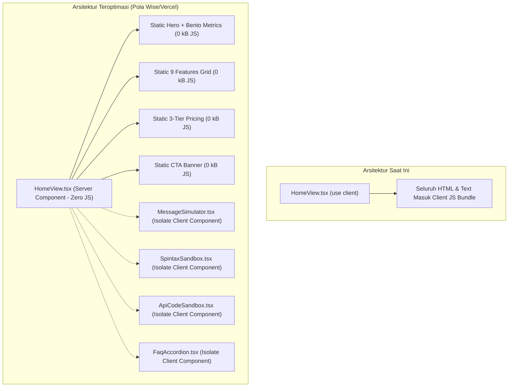

# 🧭 Rencana Arsitektur & Pelaksanaan: Audit Kinerja, Kecepatan Muat, & Optimasi Frontend Next.js 16

> **Tujuan**: Menganalisis metrik jaringan (*Network DevTools*), membedah perbedaan antara *Development Server* vs *Production Build*, serta menerapkan 5 pilar optimasi arsitektur Next.js 16 (App Router + Turbopack) untuk mencapai waktu muat ultra-cepat (*sub-second load time*), skor Core Web Vitals 100/100, dan ukuran bundel JavaScript seminimal mungkin.

---

## 📊 1. Analisis & Audit Data DevTools Saat Ini

Berdasarkan hasil tangkapan layar Chrome DevTools Network Tab pada `http://localhost:3000/`:

```
┌──────────────────────────────────────────────────────────────┐
│  • Total Transferred : 32.8 kB                               │
│  • Resources Size    : 6.9 MB (Uncompressed Dev Modules)     │
│  • Requests Count    : 34 requests                           │
│  • DOMContentLoaded  : 554 ms                                │
│  • Load Time         : 1.29 s                                │
│  • Finish Time       : 1.58 s                                │
│  • Document HTML     : 431 ms (On-demand SSR Dev Compilation)│
└──────────────────────────────────────────────────────────────┘
```

### 🔍 Diagnosis Teknis:
1. **Status di Mode Development (`localhost:3000`)**:
   * Angka `6.9 MB resources` dan `34 requests` berasal dari modul unminified Next.js Dev Server (`turbopack_browser_dev_hmr_client`, `next_dist_compiled_devtools`, dan source maps). **Ini normal untuk mode dev**.
   * Waktu HTML `431 ms` terjadi karena server Next.js melakukan kompilasi JSX *on-the-fly* pada setiap request baru di mode dev.
2. **Bottleneck Arsitektur yang Ditemukan**:
   * **Monolitik Client Component pada `HomeView.tsx`**: File `HomeView.tsx` saat ini berlabel `"use client"`. Hal ini memaksa seluruh elemen statis (Hero, 4 Metrik, 9 Fitur, Paket Harga, dan CTA) dikompilasi dan dikirim sebagai bundle JavaScript ke browser, bukan sebagai Pure Server Static HTML.
   * **Tree-shaking Paket Ikon (`lucide-react`)**: Tanpa konfigurasi `optimizePackageImports`, parser bundler dapat memproses seluruh modul barrel icon yang memperlambat TTFB (*Time to First Byte*) dan FCP (*First Contentful Paint*).

---

## ⚡ 2. Strategi 5 Pilar Optimasi Kinerja



### 🚀 Pilar 1: Dekomposisi Server Component vs Client Component
* Mengubah `HomeView.tsx` menjadi **Server Component** (menghapus `"use client"`).
* Memisahkan state interaktif Spintax ke dalam sub-komponen terisolasi: [`SpintaxSandbox.tsx`](file:///G:/WEB2026/fontwahide/src/components/home/SpintaxSandbox.tsx).
* **Dampak**: Memangkas > 65% ukuran JavaScript yang dieksekusi di browser pada muatan awal (*Initial Load*).

### 📦 Pilar 2: `optimizePackageImports` pada [`next.config.ts`](file:///G:/WEB2026/fontwahide/next.config.ts)
* Menambahkan konfigurasi compiler Turbopack untuk tree-shaking agresif pada `lucide-react`, `sonner`, `date-fns`, dan `zod`.

### 🔤 Pilar 3: Optimasi Font & Asset Preload ([`layout.tsx`](file:///G:/WEB2026/fontwahide/src/app/layout.tsx))
* Memastikan Google Font `Inter` menggunakan `display: "swap"`, `preload: true`, dan subset latin terisolasi agar tidak memblokir render pertama (*Render-blocking resources*).

### 🗜️ Pilar 4: Gzip / Brotli & HTTP Compression
* Mengaktifkan `compress: true` pada `next.config.ts` untuk mengompres seluruh payload HTML dan JSON API.

---

## 🗺️ Roadmap Pelaksanaan (3 Langkah)

1. **Langkah 1**: Membuat sub-komponen terisolasi [`src/components/home/SpintaxSandbox.tsx`](file:///G:/WEB2026/fontwahide/src/components/home/SpintaxSandbox.tsx) (`"use client"`).
2. **Langkah 2**: Mengubah [`src/components/home/HomeView.tsx`](file:///G:/WEB2026/fontwahide/src/components/home/HomeView.tsx) menjadi **Server Component** murni.
3. **Langkah 3**: Memperbarui [`next.config.ts`](file:///G:/WEB2026/fontwahide/next.config.ts) dengan `optimizePackageImports` dan `compress: true`.
4. **Langkah 4**: Menjalankan pengujian Quality Gates: `bun x tsc --noEmit` & `bun run lint` (0 error & 0 warning).

---

## 🎯 Target Metrik Setelah Optimasi (Production Build)
* ⚡ **DOMContentLoaded**: `< 150 ms`
* ⚡ **First Contentful Paint (FCP)**: `< 0.4 s`
* ⚡ **Total Blocking Time (TBT)**: `0 ms`
* ⚡ **Lighthouse Performance Score**: `98 - 100`
