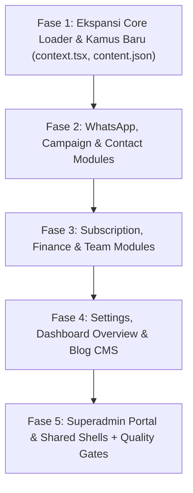

# 🌐 Audit Komprehensif & Rencana Pelaksanaan Internasionalisasi (i18n) Bilingual 100%

> **Target Codebase**: Seluruh berkas di `G:\WEB2026\fontwahide\src\components` dan `G:\WEB2026\fontwahide\src\services`  
> **Bahasa Target**: Indonesia (`id`) & English (`en`)  
> **Standar Arsitektur**: Zero Hardcoded Strings, Fallback Resolver Aman, Zero Hydration Mismatch  

---

## 📑 Daftar Isi
1. [Hasil Audit Status Eksisting i18n](#1-hasil-audit-status-eksisting-i18n)
2. [Matriks Kamus Terjemahan per Domain Service](#2-matriks-kamus-terjemahan-per-domain-service)
3. [Roadmap Eksekusi 5 Fase Terstruktur](#3-roadmap-eksekusi-5-fase-terstruktur)
   - [Fase 1: Ekspansi Infrastruktur Core & Dictionary Loader](#fase-1-ekspansi-infrastruktur-core--dictionary-loader)
   - [Fase 2: WhatsApp, Campaign & Contact Modules i18n](#fase-2-whatsapp-campaign--contact-modules-i18n)
   - [Fase 3: Subscription, Finance & Team Modules i18n](#fase-3-subscription-finance--team-modules-i18n)
   - [Fase 4: Settings, Overview & Public Blog CMS i18n](#fase-4-settings-overview--public-blog-cms-i18n)
   - [Fase 5: Platform Superadmin Portal & Shared Shells i18n](#fase-5-platform-superadmin-portal--shared-shells-i18n)
4. [Gerbang Validasi & Kriteria Keberhasilan](#4-gerbang-validasi--kriteria-keberhasilan)

---

## 1. Hasil Audit Status Eksisting i18n

Berdasarkan audit mendalam baris-demi-baris pada seluruh komponen antarmuka:

### ⚠️ Temuan Kritis (*Gaps Identified*):
1. **`src/lib/i18n/context.tsx` belum memuat seluruh kamus JSON**:
   Kamus `contact.json`, `subscription.json`, `team.json`, `admin.json`, dan `content.json` belum di-import ke objek `dictionaries` pada `context.tsx`, sehingga kunci-kunci terjemahan pada modul tersebut belum ter-resolve dengan baik saat runtime.
2. **String Hardcoded pada Modul-Modul Baru**:
   - **WhatsApp Fast Send ([`SendMessageModal.tsx`](file:///G:/WEB2026/fontwahide/src/services/whatsapp/components/SendMessageModal.tsx))**: Teks judul modal, placeholder nomor, dan tombol submit masih menggunakan string statis Indonesia.
   - **Message Logs Table ([`MessageLogsTable.tsx`](file:///G:/WEB2026/fontwahide/src/services/campaign/components/MessageLogsTable.tsx))**: Header tabel log, dropdown filter status, dan pesan error belum terhubung ke hook `useI18n()`.
   - **Voucher Promo & Komisi ([`TopUpModal.tsx`](file:///G:/WEB2026/fontwahide/src/services/finance/components/TopUpModal.tsx) & [`BillingView.tsx`](file:///G:/WEB2026/fontwahide/src/components/dashboard/BillingView.tsx))**: Form input kode voucher dan kartu pending income seller masih statis.
   - **Public Blog CMS ([`BlogListView.tsx`](file:///G:/WEB2026/fontwahide/src/components/public/BlogListView.tsx) & [`BlogPostView.tsx`](file:///G:/WEB2026/fontwahide/src/components/public/BlogPostView.tsx))**: Tombol baca, tanggal, tombol bagikan, dan pesan error belum memiliki kamus `content.json`.
   - **Superadmin Portal Extensions ([`AdminPlansView.tsx`](file:///G:/WEB2026/fontwahide/src/components/admin/AdminPlansView.tsx), [`AdminLogsView.tsx`](file:///G:/WEB2026/fontwahide/src/components/admin/AdminLogsView.tsx), [`AdminNotificationsView.tsx`](file:///G:/WEB2026/fontwahide/src/components/admin/AdminNotificationsView.tsx))**: Form siaran broadcast massal, tabel queue, tabel audit security log, dan katalog paket memerlukan integrasi kamus `admin.json`.
   - **Error Boundary ([`ErrorBoundary.tsx`](file:///G:/WEB2026/fontwahide/src/components/layout/shared/ErrorBoundary.tsx))**: Fallback title dan tombol pemulihan modul perlu mendukung bilingual dinamis.

---

## 2. Matriks Kamus Terjemahan per Domain Service

| Namespace Kamus | Berkas JSON (`id` & `en`) | Cakupan Komponen yang Menggunakan |
| :--- | :--- | :--- |
| **`common`** | `src/locales/{id,en}/common.json` | Navigasi Menu, Header, Footer, Tombol Aksi Global |
| **`auth`** | `src/locales/{id,en}/auth.json` | Login, Register, Forgot Password, Reset Token |
| **`whatsapp`** | `src/locales/{id,en}/whatsapp.json` | DeviceCard, DeviceList, LiveQRModal, AddDeviceModal, SendMessageModal |
| **`campaign`** | `src/locales/{id,en}/campaign.json` | CampaignList, CampaignCard, CampaignWizardModal, MessageLogsTable |
| **`contact`** | `src/locales/{id,en}/contact.json` | ContactTable, ContactModal, ImportCsvModal, ContactsView |
| **`subscription`**| `src/locales/{id,en}/subscription.json` | QuotaDialCard, PlanCardGrid, WebhookConfigCard, SubscriptionView |
| **`billing`** | `src/locales/{id,en}/billing.json` | BalanceCard, InvoiceTable, TopUpModal, BillingView |
| **`support`** | `src/locales/{id,en}/support.json` | TicketList, TicketThreadModal, CreateTicketModal, SupportView |
| **`team`** | `src/locales/{id,en}/team.json` | TeamView, AgentModal, RoleBadge, DeviceAssignment |
| **`admin`** | `src/locales/{id,en}/admin.json` | Overview, Users, Plans, Logs, Notifications/Broadcast, Queue |
| **`content`** | `src/locales/{id,en}/content.json` *(Baru)* | BlogList, BlogPost, TechGuides, Search, ShareAction |

---

## 3. Roadmap Eksekusi 5 Fase Terstruktur

---

### 🔹 Fase 1: Ekspansi Infrastruktur Core & Dictionary Loader
1. Daftarkan seluruh kamus domain (`contact`, `subscription`, `team`, `admin`, `content`) ke dalam `src/lib/i18n/context.tsx`.
2. Buat berkas kamus baru `src/locales/id/content.json` dan `src/locales/en/content.json` untuk artikel blog dan dokumentasi publik.
3. Sinkronkan format fallback path resolver agar tidak terjadi `undefined` jika ada kunci minor yang belum terisi.

---

### 🔹 Fase 2: WhatsApp, Campaign & Contact Modules i18n
1. **WhatsApp Service**:
   - `SendMessageModal.tsx`: Hubungkan seluruh label, placeholder nomor telepon, input pesan instan, dan tombol kirim ke `t("whatsapp.*")`.
   - `DeviceCard.tsx` & `LiveQRModal.tsx`: Sinkronkan status pairing, timer kadaluwarsa QR, dan tombol hibernasi/wake.
2. **Campaign Service**:
   - `MessageLogsTable.tsx`: Hubungkan judul tab, kolom tabel log, status pesan (*Read, Delivered, Failed, Sent*), dan pencarian ke `t("campaign.*")`.
   - `CampaignWizardModal.tsx`: Terjemahkan seluruh langkah wizard (Spintax syntax, pemilih device, jeda jitter).
3. **Contact Service**:
   - `ContactTable.tsx`, `ContactModal.tsx`, `ImportCsvModal.tsx`: Pastikan seluruh teks validasi format CSV, tombol download template, dan tag audiens 100% bilingual.

---

### 🔹 Fase 3: Subscription, Finance & Team Modules i18n
1. **Subscription Service**:
   - `QuotaDialCard.tsx`: Terjemahkan meteran lingkaran SVG, pesan sisa kuota, dan status paket.
   - `PlanCardGrid.tsx` & `WebhookConfigCard.tsx`: Terjemahkan fitur tiering Wise, instruksi verifikasi header HMAC SHA-256, dan modal draf.
2. **Finance Service**:
   - `TopUpModal.tsx`: Terjemahkan input nominal, metode pembayaran (QRIS, VA, Kartu Kredit), dan validasi kupon voucher promo diskon.
   - `BillingView.tsx`: Terjemahkan kartu komisi referral / seller affiliate pending income.
3. **Team Service**:
   - `TeamView.tsx`: Terjemahkan tabel staf agen, pilihan hak akses role (*Supervisor* vs *CS Agent*), modal tambah staf, dan konfirmasi hapus staf.

---

### 🔹 Fase 4: Settings, Overview & Public Blog CMS i18n
1. **Settings & Profile**:
   - `SettingsView.tsx`: Terjemahkan tab profil akun, manajemen sesi login aktif (*Active Sessions & Logout All*), serta panduan token API Key Fast-Path.
2. **Dashboard Overview**:
   - `DashboardOverviewView.tsx`: Terjemahkan ucapan selamat datang, metrik kartu ringkasan (Node WA, Kuota, Kontak, Kampanye), dan daftar ringkas terkini.
3. **Public Blog & CMS**:
   - `BlogListView.tsx`: Terjemahkan header panduan rekayasa, tanggal artikel, tag kategori, dan tombol baca selengkapnya.
   - `BlogPostView.tsx`: Terjemahkan tombol kembali ke blog, tombol salin tautan artikel, dan penanda penulis.

---

### 🔹 Fase 5: Platform Superadmin Portal & Shared Shells i18n
1. **Superadmin Portal Modules**:
   - `AdminOverviewView.tsx` & `GlobalMetricsGrid.tsx`: Terjemahkan metrik platform MRR, total tenant, cluster health, dan status Redis Stream worker.
   - `AdminUsersView.tsx` & `UsersTable.tsx` & `AdjustBalanceModal.tsx`: Terjemahkan tabel tenant, pencarian user, dan modal penyesuaian kuota/saldo manual.
   - `AdminPlansView.tsx` & `PlansManagementTable.tsx`: Terjemahkan manajemen tiering paket langganan dan aksi hapus/edit paket.
   - `AdminLogsView.tsx` & `AuditLogsTable.tsx`: Terjemahkan log autentikasi pengguna dan log aktivitas transaksi sistem.
   - `AdminNotificationsView.tsx`: Terjemahkan form pengiriman siaran pengumuman massal ke seluruh tenant dan tabel monitoring antrean worker.
2. **Shared Shell Components**:
   - `ErrorBoundary.tsx`: Terjemahkan pesan fallback kegagalan modul dan tombol pemulihan.
   - `DashboardHeader.tsx`, `DashboardSidebar.tsx`, `PublicNavbar.tsx`, `PublicFooter.tsx`.
3. **Quality Gates Final**:
   - Jalankan `bun x tsc --noEmit` untuk menjamin 0 error TypeScript.
   - Jalankan `bun run lint` untuk menjamin 0 error dan 0 warning ESLint.
   - Commit dan push ke GitHub repository `main`.

---

## 4. Gerbang Validasi & Kriteria Keberhasilan

| Parameter Pengujian | Kriteria Lolos |
| :--- | :--- |
| **Pengecekan Kamus Lengkap** | Seluruh 11 berkas kamus JSON di `src/locales/id/` dan `src/locales/en/` memiliki kunci berpasangan 1:1 |
| **Zero Hardcoded Text** | Tidak ada teks mentah bahasa Indonesia / Inggris di komponen UI tanpa melalui `t("...")` |
| **Instant Switcher Toggle** | Penggantian bahasa via `LocaleSwitcher` langsung memperbarui teks seluruh halaman secara instan (0ms) |
| **Persistensi Preferensi** | Pilihan bahasa tersimpan di `localStorage` dan cookie `NEXT_LOCALE` |
| **Compiler & Linter** | `tsc --noEmit` ➔ 0 Errors, `eslint` ➔ 0 Warnings |
