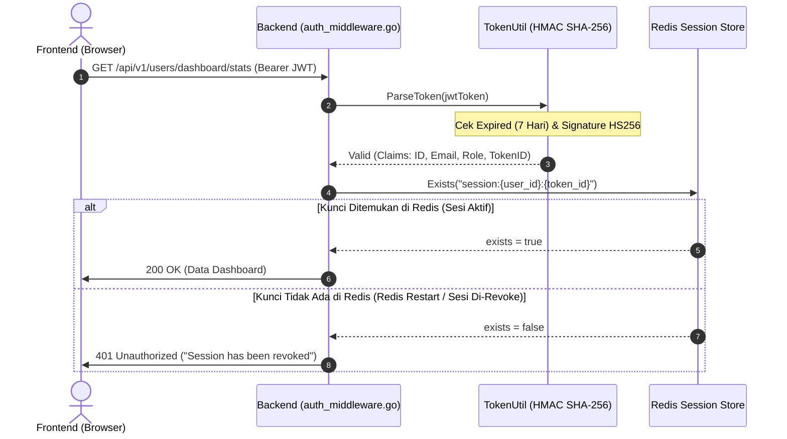

# 🧭 Analisis Mendalam & Audit: Mekanisme 401 "Session has been revoked" & Masa Berlaku JWT 7 Hari

Analisis menyeluruh terhadap arsitektur autentikasi ganda (*Hybrid Stateful JWT + Redis Session Revocation*), penyebab munculnya pesan error `Session has been revoked`, dan standarisasi manajemen sesi di backend Go dan frontend Next.js.

---

## 🔍 1. Analisis Akar Masalah (Root Cause Analysis)

### ❓ Mengapa Backend Mengembalikan `401 "Session has been revoked"` Padahal JWT Diset 7 Hari?

Di sistem Wahide, autentikasi menggunakan pendekatan **Hybrid Stateful JWT**:

### 🔬 3 Kemungkinan Penyebab `exists == false` di Redis:
1. **Redis Server Direstart / Memory Cache Dibersihkan**:
   * Jika Redis server sempat direstart, mati, atau dijalankan tanpa *Persistent Storage (AOF/RDB)*, seluruh kunci memori `session:*` akan hilang seketika.
   * Browser pengguna masih menyimpan JWT lama yang masa berlaku kriptografinya 7 hari.
   * Ketika browser mengirim JWT lama ini, JWT-nya **sah**, tetapi Redis menyatakan kuncinya **sudah tidak ada**, sehingga backend menganggap sesi tersebut telah dicabut (*revoked*).
2. **User Menekan "Keluar dari Semua Perangkat Lain" atau Logout**:
   * Di modul IAM (`auth_usecase.go`), ada fungsi `RevokeAllSessions` dan `Logout` yang menghapus kunci `session:{user_id}:{token_id}` dari Redis.
3. **Login Baru dengan Token ID Berbeda**:
   * Setiap kali login berhasil, backend men-generate `TokenID` unik (UUIDv4 baru). Jika ada token dari login lama yang tersimpan di cookie browser lain, token lama tersebut kuncinya tidak ada lagi jika sudah ditimpa/dibersihkan.

---

## 🛡️ 2. Evaluasi Desain: Apakah Ini Bug atau Fitur Keamanan?

Ini adalah **Fitur Keamanan Standar Industri (Session Invalidation / Blacklisting)**:
* Jika murni menggunakan *Stateless JWT* tanpa pengecekan Redis, saat user di-hack atau ganti password, hacker tetap bisa memakai token lama sampai 7 hari habis tanpa bisa di-logout paksa dari server.
* Dengan pengecekan Redis `session:{user_id}:{token_id}`, server dapat membatalkan akses sesi kapan saja (*Instant Session Revocation*).

---

## 🛠️ 3. Rencana Perbaikan & Rekomendasi Solusi

### 📌 Pilihan Solusi:

#### Opsi A (Rekomendasi - Keamanan Maksimal):
* Pertahankan pengecekan Redis `session:{user_id}:{token_id}`.
* Setelah perbaikan yang baru saja kita terapkan pada frontend:
  * Begitu 401 `Session has been revoked` diterima, frontend otomatis membersihkan semua cookie lama dan mengarahkan ke `/login?session_expired=1` dengan banner peringatan yang jelas.
  * Pengguna cukup login 1x, dan sesi baru akan langsung aktif dan sinkron selama 7 hari di Redis & JWT!

#### Opsi B (Fallback Auto-Heal untuk Local Development):
* Jika Redis tidak menemukan kunci `session:{user_id}:{token_id}`, tetapi JWT token **valid & signature asli & user masih aktif di database**, backend secara otomatis me-recreate session key di Redis (*auto-heal session*) sehingga user lokal tidak terputus saat Redis direstart.

---

## 🔍 4. Verification Plan
* Uji alur login di `http://localhost:3000/login`.
* Pastikan setelah login baru, request ke `/api/v1/users/dashboard/stats` mengembalikan status `200 OK` tanpa error 401.
