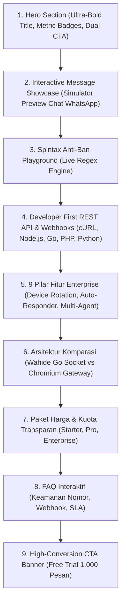

# 🚀 Rencana Arsitektur & Konten: Landing Page WhatsApp Gateway Enterprise (Benchmark: Fonnte, Wablas, RuangWA, WhaCenter)

> **Tujuan**: Mengembangkan landing page `http://localhost:3000/` dengan kurasi konten profesional berstandar industri (*Tier-1 Enterprise B2B SaaS*), mengadaptasi fitur unggulan gateway WhatsApp terpopuler (Fonnte, Wablas, RuangWA, WhaCenter, Woowa), dengan arsitektur **Wise Design System**, **Zero AI-Slop**, serta **100% Dukungan Bilingual (ID & EN)**.  

---

## 📑 Daftar Isi
1. [Analisis Komparasi Fitur Industri (Benchmark Fonnte, Wablas, RuangWA, WhaCenter)](#1-analisis-komparasi-fitur-industri-benchmark-fonnte-wablas-ruangwa-whacenter)
2. [Struktur & Rangkaian Bagian (*Section Architecture*) Landing Page](#2-struktur--rangkaian-bagian-section-architecture-landing-page)
   - [Section 1: Hero Section & Quick Action Simulator](#section-1-hero-section--quick-action-simulator)
   - [Section 2: Interactive Message Type Showcase (Text, Media, Button, OTP, List)](#section-2-interactive-message-type-showcase-text-media-button-otp-list)
   - [Section 3: Spintax & 5-Layer Anti-Ban Interactive Sandbox](#section-3-spintax--5-layer-anti-ban-interactive-sandbox)
   - [Section 4: Multi-Language REST API & Webhook Code Sandbox](#section-4-multi-language-rest-api--webhook-code-sandbox)
   - [Section 5: Core Enterprise Feature Matrix (9 Pilar Keunggulan)](#section-5-core-enterprise-feature-matrix-9-pilar-keunggulan)
   - [Section 6: Tabel Perbandingan Arsitektur (Wahide Go vs Node.js Chromium)](#section-6-tabel-perbandingan-arsitektur-wahide-go-vs-nodejs-chromium)
   - [Section 7: Paket Berlangganan & Kuota Transparan (Pricing Grid)](#section-7-paket-berlangganan--kuota-transparan-pricing-grid)
   - [Section 8: FAQ Accordion Interaktif](#section-8-faq-accordion-interaktif)
   - [Section 9: High-Conversion CTA Banner & Guarantee Badges](#section-9-high-conversion-cta-banner--guarantee-badges)
3. [Rencana Kamus Bilingual i18n (`landing.*`)](#3-rencana-kamus-bilingual-i18n-landing)
4. [Roadmap Pelaksanaan Bertahap (4 Fase)](#4-roadmap-pelaksanaan-bertahap-4-fase)
5. [Kriteria Kualitas & Verifikasi (Quality Gates)](#5-kriteria-kualitas--verifikasi-quality-gates)

---

## 1. Analisis Komparasi Fitur Industri (Benchmark Fonnte, Wablas, RuangWA, WhaCenter)

| Domain Fitur | Fitur Standar Kompetitor (Fonnte/Wablas/WhaCenter) | Keunggulan Inovasi Wahide (Go Microservice Engine) |
| :--- | :--- | :--- |
| **Koneksi WhatsApp** | Multi-Device QR Pairing via Node.js / Puppeteer | **whatsmeow Native Go Socket Protocol** (<150MB RAM, zero Chromium) |
| **Proteksi Anti-Ban** | Jeda waktu statis (delay detik) | **5-Layer Dynamic Anti-Ban** (Spintax Regex, Human Typing Simulation, Jitter Delay, Multi-Device Auto-Rotate) |
| **Rotasi Nomor Pengirim** | Manual ganti device di form broadcast | **Multi-Device Round-Robin Rotation** (Bagi beban broadcast otomatis ke 3-10 nomor) |
| **Jenis Pesan** | Teks, Gambar, File Dokumen, Tombol | **Full WhatsApp Payload**: Teks, Gambar HD, PDF, Audio Voice Note, OTP Card, Interactive Buttons, List Menu |
| **Integrasi API** | HTTP POST standar | **Idempotent REST API, HMAC SHA256 Signature Webhook, & SDK Code Generator** |
| **Manajemen Tim** | Single login bersama | **Multi-Agent CS Team Portal** dengan role isolation dan slot WhatsApp delegasi |

---

## 2. Struktur & Rangkaian Bagian (*Section Architecture*) Landing Page

---

### Section 1: Hero Section & Quick Action Simulator
* **Value Proposition**: *Infrastruktur WhatsApp Multi-Device Gateway Skala Industri*.
* **Sub-Heading**: *Otomasi pesan broadcast massal, OTP kilat, dan webhook dua arah dengan 5 Lapis Anti-Ban dan konsumsi memori 95% lebih hemat.*
* **Metrik Kinerja Live**:
  - `99.9%` Uptime SLA
  - `<150MB` RAM per 1.000 Sesi
  - `<0.3s` Webhook Dispatch Latency
  - `5 Lapis` Proteksi Anti-Ban

---

### Section 2: Interactive Message Type Showcase (Simulator Preview Chat)
* **Tab Pilihan Tipe Pesan**:
  1. **Pesan Teks & Personalisasi**: Dukungan variabel nama, nomor invoice, spintax.
  2. **Media & Dokumen**: Kirim PDF faktur, gambar promosi produk, audio.
  3. **Pesan OTP Kilat**: Template verifikasi login aman dengan high-priority queue.
  4. **Tombol Interaktif & URL Call-to-Action**: Tombol balas cepat dan link eksternal.
  5. **Menu Pilihan (List Messages)**: Navigasi katalog produk dan menu CS bot.
* **Tampilan Visual**: Card mockup layar obrolan WhatsApp berdesain Wise (Dark & Light mode) yang merespons perubahan tab secara real-time.

---

### Section 3: Spintax & 5-Layer Anti-Ban Interactive Sandbox
* Pengguna dapat mengetik template teks spintax `{Halo|Hai|Selamat Pagi} {Bpk/Ibu|Kak}` dan menekan tombol *Acak Variasi Baru* untuk melihat bagaimana sistem merotasi kombinasi kata agar terhindar dari spam hash filter WhatsApp.

---

### Section 4: Multi-Language REST API & Webhook Code Sandbox
* **Tab Bahasa Pemrograman**:
  - **cURL**: `curl -X POST https://api.wahide.id/v1/messages/send ...`
  - **Node.js**: Contoh menggunakan `fetch` / `axios`.
  - **Go**: Contoh menggunakan `http.NewRequestWithContext`.
  - **PHP / Laravel**: Contoh menggunakan `Http::withHeaders()`.
  - **Python**: Contoh menggunakan `requests.post()`.
* Dilengkapi fitur **Copy Code Snippet** dengan toast feedback instan.

---

### Section 5: Core Enterprise Feature Matrix (9 Pilar Keunggulan)
1. **Multi-Device Socket Gateway**: Engine whatsmeow ultra cepat.
2. **Multi-Device Load Balancing**: Rotasi pengiriman otomatis antar 3–10 nomor.
3. **Smart Inbound Webhook**: Forwarding pesan masuk dengan verifikasi HMAC SHA256.
4. **Auto-Responder & Keyword Bot**: Balas otomatis berbasis kata kunci persis/regex.
5. **Manajemen Kontak & Excel Import**: Import 50.000+ kontak instan via spreadsheet.
6. **Jitter Delay & Random Backoff**: Jeda pengiriman acak 3-15 detik yang aman.
7. **Multi-Agent CS Collaboration**: Pembagian tiket chat ke staf customer service.
8. **Statistik Pengiriman Real-Time**: Log detail status *Read, Delivered, Failed*.
9. **Zero-Heap Event Filtering**: Menjaga stabilitas server pada jutaan event pesan.

---

### Section 6: Tabel Perbandingan Arsitektur (Wahide Go vs Gateway Chromium)
Menjelaskan secara transparan mengapa arsitektur Go Socket Wahide jauh lebih hemat biaya server, lebih stabil, dan minim risiko memory leak dibanding gateway berbasis Chromium/Puppeteer.

---

### Section 7: Paket Berlangganan & Kuota Transparan (Pricing Grid)
* **Free Trial / Starter**: Rp 0 / bulan (1 Device Slot, 1.000 Kuota Pesan, REST API, Webhooks).
* **Pro Merchant**: Rp 99.000 / bulan (3 Device Slots dengan Auto-Rotate, 25.000 Kuota Pesan, Multi-Agent CS).
* **Enterprise Gateway**: Rp 299.000 / bulan (10 Device Slots, 100.000+ Kuota Pesan, Prioritas Redis Queue, 99.9% SLA).

---

### Section 8: FAQ Accordion Interaktif
Menjawab pertanyaan esensial:
1. *Apakah nomor WhatsApp saya aman dari pemblokiran?*
2. *Bagaimana cara menghubungkan nomor WhatsApp ke sistem?*
3. *Apakah mendukung integrasi Webhook dua arah?*
4. *Apa bedanya Wahide dengan WhatsApp Cloud API resmi?*
5. *Apakah bisa digunakan untuk pengiriman OTP transaksional?*

---

### Section 9: High-Conversion CTA Banner & Guarantee Badges
* Ajakan langsung untuk mendaftar akun gratis (*1.000 Pesan Kuota Uji Coba Langsung Aktif tanpa Kartu Kredit*).

---

## 3. Rencana Kamus Bilingual i18n (`landing.*`)

Memperluas kamus `src/locales/id/common.json` dan `src/locales/en/common.json` dengan namespace terstruktur:
* `landing.hero.*`
* `landing.showcase.*`
* `landing.apiSandbox.*`
* `landing.features.*`
* `landing.comparison.*`
* `landing.pricing.*`
* `landing.faq.*`
* `landing.cta.*`

---

## 4. Roadmap Pelaksanaan Bertahap (4 Fase)

### 🔹 **Fase 1: Penyiapan Kamus Bilingual i18n Lengkap**
* Tambahkan seluruh teks terjemahan ID & EN untuk 9 bagian konten di `common.json`.

### 🔹 **Fase 2: Pembuatan Sub-Komponen Interaktif**
* `MessageSimulator.tsx`: Simulator pesan interaktif WhatsApp (Text, Media, Button, OTP, List).
* `ApiCodeSandbox.tsx`: Tab pemilih bahasa kode integrasi (cURL, Node.js, Go, PHP, Python) dengan tombol salin.
* `FaqAccordion.tsx`: Accordion interaktif pertanyaan umum.

### 🔹 **Fase 3: Integrasi & Penyempurnaan `HomeView.tsx`**
* Rangkai seluruh sub-komponen ke dalam [`HomeView.tsx`](file:///G:/WEB2026/fontwahide/src/components/home/HomeView.tsx) dengan desain Wise Aesthetic murni (zero emoji AI-slop).

### 🔹 **Fase 4: Verifikasi Kualitas (Quality Gates)**
* Jalankan `bun x tsc --noEmit` & `bun run lint` (0 error & 0 warning).
* Verifikasi tampilan visual di browser `http://localhost:3000/`.

---

## 5. Kriteria Kualitas & Verifikasi (Quality Gates)

| Parameter | Target Standar |
| :--- | :--- |
| **Estetika Desain** | Wise Aesthetic (Lime green `#9fe870`, Dark `#0e0f0c`, Pill buttons, Clean cards) |
| **Tone of Voice** | B2B SaaS Enterprise, lugas, teknis, kredibel, **Zero AI-slop emoji** |
| **Interaktivitas** | Simulator pesan, spintax sandbox, dan code switcher berjalan instan (*client-side reactive*) |
| **Dukungan Bahasa** | Beralih antara `ID` dan `EN` mengubah seluruh teks landing page secara instan |
| **Compiler & Linter** | `tsc --noEmit` ➔ 0 Errors, `eslint` ➔ 0 Warnings |
