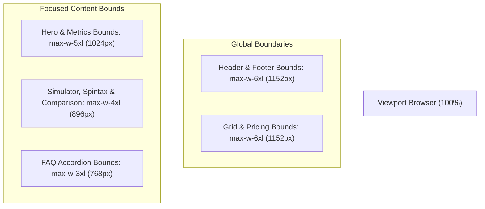

# 🧭 Rencana Arsitektur & Pelaksanaan: Audit Tata Letak, Pembatasan Lebar (Container Constraints), & Penyempurnaan UI/UX Landing Page

> **Tujuan**: Mengatasi masalah tata letak yang terasa terlalu melebar (*overly wide / stretched*) di layar desktop/monitor besar dengan menerapkan kontainer ergonomis standar SaaS Tier-1 (**Wise / Linear / Stripe**), menyempurnakan hierarki tipografi, ritme spasi vertikal (*vertical rhythm*), serta visual density agar pengalaman pengguna (UI/UX) terasa lebih padat, fokus, elegan, dan profesional.

---

## 📑 Daftar Isi
1. [Hasil Audit Masalah Tata Letak & UX Saat Ini](#1-hasil-audit-masalah-tata-letak--ux-saat-ini)
2. [Arsitektur Lebar Kontainer Baru (*Responsive Container Blueprint*)](#2-arsitektur-lebar-kontainer-baru-responsive-container-blueprint)
3. [Penyempurnaan Per Komponen & Bagian (9 Section)](#3-penyempurnaan-per-komponen--bagian-9-section)
4. [Penyelarasan Header & Footer Navigasi](#4-penyelarasan-header--footer-navigasi)
5. [Roadmap Pelaksanaan Bertahap (4 Tahap)](#5-roadmap-pelaksanaan-bertahap-4-tahap)
6. [Verifikasi Quality Gates & Standar Visual](#6-verifikasi-quality-gates--standar-visual)

---

## 1. Hasil Audit Masalah Tata Letak & UX Saat Ini

| Bagian | Masalah Saat Ini | Dampak Pengalaman Pengguna (UX) |
| :--- | :--- | :--- |
| **Hero Section** | Menggunakan `max-w-7xl` (`1280px`) dengan teks rata kiri yang terlalu panjang | Teks judul & deskripsi terlalu melebar ke kanan, menyisakan ruang kosong besar di sebelah kanan pada monitor 1080p/2K. |
| **Kartu Metrik (4 Cards)** | Grid 4 kolom meregang penuh sepanjang `1280px` | Kartu metrik terlihat terpisah terlalu jauh (*disconnected*) dan kurang solid sebagai satu kesatuan. |
| **Tabel Komparasi Arsitektur** | Tabel memenuhi `max-w-7xl` (`1280px`) | Kolom kriteria sangat lebar, jarak teks antar kolom terlalu jauh sehingga sulit dipindai (*scan*) mata pengguna. |
| **Spintax & Code Sandbox** | Terlalu renggang pada layar lebar | Input teks dan blok kode kehilangan kesan alat simulasi interaktif yang kompak. |
| **Paket Harga (3 Tiers)** | 3 kartu meregang di `max-w-7xl` | Kartu harga terlalu lebar dan kehilangan fokus hierarki paket unggulan (*Pro Merchant*). |
| **FAQ Accordion** | Sudah `max-w-4xl`, namun spasi sekitarnya belum menyatu harmonis | Ritme vertikal (*vertical rhythm*) terputus. |

---

## 2. Arsitektur Lebar Kontainer Baru (*Responsive Container Blueprint*)

Mengelompokkan konten ke dalam 3 hierarki lebar kontainer kanonikal:

* 🎯 **`max-w-6xl` (1152px)**: Header, Footer, 9 Pilar Fitur Enterprise, dan 3-Tier Pricing Table.
* 🎯 **`max-w-5xl` (1024px)**: Hero Section utama (Pusat perhatian konversi) & 4 Kartu Metrik Ringkas.
* 🎯 **`max-w-4xl` (896px)**: Simulator WhatsApp, Spintax Playground, REST API Code Sandbox, Tabel Komparasi Teknis, dan CTA Banner Akhir.
* 🎯 **`max-w-3xl` (768px)**: FAQ Accordion (Optimal untuk keterbacaan artikel tanya-jawab).

---

## 3. Penyempurnaan Per Komponen & Bagian (9 Section)

### 1. 🌟 Hero Section & Metrik
* **Tata Letak**: Terpusat (*centered & balanced*) atau *focused compact left* dengan batas teks `max-w-3xl` pada judul H1 dan `max-w-2xl` pada subjudul.
* **Ukuran Tipografi**: Skala font judul yang proporsional: `text-3xl sm:text-5xl lg:text-6xl font-black` dengan `leading-[1.05]` (tidak terlalu raksasa/renggang).
* **Kartu Metrik (Bento Style)**: Dibungkus dalam kontainer `max-w-5xl mx-auto` dengan padding `p-4 sm:p-5` yang lebih padat dan tegas.

### 2. 📱 WhatsApp Message Simulator
* Kontainer luar `max-w-4xl mx-auto` dengan latar belakang kartu yang lebih halus (*subtle elevation*).

### 3. 🧪 Spintax Playground & 💻 REST API Sandbox
* Dibatasi pada `max-w-4xl mx-auto` sehingga panel input kiri dan hasil kanan terlihat berdampingan rapi tanpa ruang kosong berlebih.

### 4. ⚡ 9 Pilar Fitur Enterprise
* Kontainer `max-w-6xl mx-auto` dengan padding kartu `p-5 sm:p-6` dan grid `gap-4 sm:gap-6` (lebih rapat dan solid).

### 5. 📊 Tabel Komparasi Arsitektur
* Dibatasi pada `max-w-4xl mx-auto` sehingga perbandingan antara Wahide dan Gateway Tradisional mudah dibaca berdampingan.

### 6. 💳 Tabel Paket Harga 3-Tier
* Kontainer `max-w-5xl mx-auto` dengan perbandingan visual yang menonjolkan paket **Pro Merchant (Rp 10.000)** di tengah.

### 7. ❓ FAQ Accordion
* Dibatasi pada `max-w-3xl mx-auto` dengan transisi buka-tutup yang mulus.

### 8. 🚀 CTA Banner Akhir
* Dibatasi pada `max-w-4xl mx-auto` dengan padding vertikal `py-10 sm:py-12` yang kompak dan berkonversi tinggi.

---

## 4. Penyelarasan Header & Footer Navigasi

* **PublicHeader ([`PublicHeader.tsx`](file:///G:/WEB2026/fontwahide/src/components/layout/public/PublicHeader.tsx))**:
  * Mengubah kontainer dari `max-w-7xl` menjadi **`max-w-6xl mx-auto`** agar garis batas logo dan tombol auth presisi sejajar dengan grid konten di bawahnya.
* **PublicFooter ([`PublicFooter.tsx`](file:///G:/WEB2026/fontwahide/src/components/layout/public/PublicFooter.tsx))**:
  * Mengubah kontainer dari `max-w-7xl` menjadi **`max-w-6xl mx-auto`** sehingga 4 kolom informasi tampak padat, rapi, dan mudah dipindai.

---

## 5. Roadmap Pelaksanaan Bertahap (4 Tahap)

### 🔹 **Tahap 1: Penyesuaian Header & Footer Bounds**
* Menyesuaikan kontainer `PublicHeader.tsx` dan `PublicFooter.tsx` ke `max-w-6xl`.

### 🔹 **Tahap 2: Restrukturisasi Hero Section & Metrik**
* Menerapkan batas lebar `max-w-5xl` pada Hero Section dan Bento Grid metrik performa di `HomeView.tsx`.

### 🔹 **Tahap 3: Restrukturisasi Interactive Sandboxes & Tables**
* Menerapkan batas lebar `max-w-4xl` pada Simulator, Spintax, API Sandbox, dan Tabel Komparasi.

### 🔹 **Tahap 4: Restrukturisasi Features, Pricing, & CTA Banner**
* Menerapkan `max-w-6xl` pada Fitur, `max-w-5xl` pada Pricing, dan `max-w-4xl` pada CTA Banner.

---

## 6. Verifikasi Quality Gates & Standar Visual

1. **Uji Responsivitas Multi-Resolusi**:
   * Mobile (375px - 640px) ➔ Padding tepi nyaman (`px-4 sm:px-6`).
   * Tablet / Laptop (768px - 1024px) ➔ Grid bento terdistribusi seimbang.
   * Desktop & Monitor Lebar (1280px - 1920px+) ➔ Konten tetap terpusat (*centered & snug*), tidak meregang berlebihan.
2. **Uji Validasi Kode**:
   * `bun x tsc --noEmit` (0 errors)
   * `bun run lint` (0 warnings)
