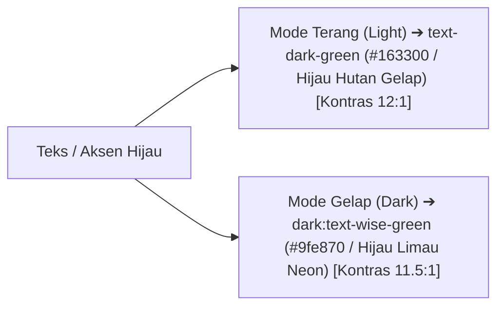

# 🎨 Rencana Arsitektur & Pelaksanaan: Audit & Perbaikan Kontras Warna Teks di Mode Terang (Light Mode Contrast Fix)

> **Tujuan**: Memperbaiki masalah keterbacaan (*readability & accessibility*) pada **Mode Terang (Light Mode)** di mana teks beraksen hijau (`text-wise-green` / `#9fe870`) tampak pudar dan sulit dibaca di atas latar belakang putih/terang (`#fbfcf9` / `#ffffff`).  
> **Standar Aksesibilitas**: WCAG 2.1 Level AA (Rasio Kontras Minimum 4.5:1 untuk teks normal dan 3:1 untuk teks tebal/badge).  

---

## 📑 Daftar Isi
1. [Temuan Audit Masalah Kontras Warna Light Mode](#1-temuan-audit-masalah-kontras-warna-light-mode)
2. [Solusi Arsitektur Desain Sistem Wise Dual-Tone](#2-solusi-arsitektur-desain-sistem-wise-dual-tone)
3. [Daftar Komponen & Bagian yang Perlu Disesuaikan](#3-daftar-komponen--bagian-yang-perlu-disesuaikan)
4. [Roadmap Pelaksanaan Bertahap (3 Langkah)](#4-roadmap-pelaksanaan-bertahap-3-langkah)
5. [Verifikasi Visual & Quality Gates](#5-verifikasi-visual--quality-gates)

---

## 1. Temuan Audit Masalah Kontras Warna Light Mode

Berdasarkan gambar tangkapan layar yang Anda kirimkan:
* **Penyebab**: Variabel warna `--color-wise-green` didefinisikan sebagai `#9fe870` (hijau limau cerah).
  - Di **Mode Gelap (Dark Mode)**: Teks `#9fe870` di atas latar `#0e0f0c` memiliki rasio kontras sangat tinggi (**11.5:1** ➔ sangat tajam & jelas).
  - Di **Mode Terang (Light Mode)**: Teks `#9fe870` di atas latar putih `#fbfcf9` memiliki rasio kontras sangat rendah (**1.35:1** ➔ teks tampak silau, pudar, dan hampir tidak terbaca).

### 🔍 Titik-Titik Elemen yang Mengalami Masalah di Light Mode:
1. **Tabel Perbandingan Arsitektur ([`HomeView.tsx`](file:///G:/WEB2026/fontwahide/src/components/home/HomeView.tsx))**:
   - Header Kolom: `WAHIDE (GO NATIVE SOCKET)` (`text-wise-green`).
   - Baris Data: `< 150 MB (Sangat Ringan)`, `Native Socket whatsmeow Protocol`, `< 0.3 Detik (Instan)`, `Ya (Auto-Hibernate saat idle)`, `Ya (Round-Robin Otomatis)`.
2. **Badge-Badge Kategori (*Pill Badges*)**:
   - `Perbandingan Arsitektur`, `Simulator Pesan Multi-Format`, `Developer First & REST API`, `9 Pilar Fitur Enterprise`, `Paket Harga & Kuota Transparan`, `Pertanyaan Sering Diajukan`.
3. **Kartu Metrik Kinerja (*Key Metrics Grid*)**:
   - Angka `95%` (`text-wise-green`).
4. **Halaman Publik Lainnya**:
   - Teks aksen hijau di [`AboutView.tsx`](file:///G:/WEB2026/fontwahide/src/components/public/AboutView.tsx), [`ContactUsView.tsx`](file:///G:/WEB2026/fontwahide/src/components/public/ContactUsView.tsx), [`PrivacyView.tsx`](file:///G:/WEB2026/fontwahide/src/components/public/PrivacyView.tsx), dan [`TermsView.tsx`](file:///G:/WEB2026/fontwahide/src/components/public/TermsView.tsx).

---

## 2. Solusi Arsitektur Desain Sistem Wise Dual-Tone

Menggunakan kombinasi utility class Tailwind responsif tema: **`text-dark-green dark:text-wise-green`** atau **`text-emerald-800 dark:text-wise-green`**:

* **Mode Terang**: Teks menggunakan `#163300` (*Dark Forest Green*) atau `#065f46` (*Emerald 800*) sehingga terbaca sangat tajam, profesional, dan nyaman di mata.
* **Mode Gelap**: Teks tetap menggunakan `#9fe870` (*Wise Lime Green*) yang menyala dan futuristik.

---

## 3. Daftar Komponen & Bagian yang Perlu Disesuaikan

| Berkas | Bagian / Komponen | Perubahan Utility Class |
| :--- | :--- | :--- |
| [`HomeView.tsx`](file:///G:/WEB2026/fontwahide/src/components/home/HomeView.tsx) | Tabel Komparasi Header & Sel | `text-dark-green dark:text-wise-green font-black` |
| [`HomeView.tsx`](file:///G:/WEB2026/fontwahide/src/components/home/HomeView.tsx) | Kartu Metrik RAM `95%` | `text-dark-green dark:text-wise-green font-black` |
| [`HomeView.tsx`](file:///G:/WEB2026/fontwahide/src/components/home/HomeView.tsx) | Seluruh Pill Badges di Section | `bg-wise-green/20 dark:bg-wise-green/15 text-dark-green dark:text-wise-green` |
| [`MessageSimulator.tsx`](file:///G:/WEB2026/fontwahide/src/components/home/MessageSimulator.tsx) | Badge & Tab Terpilih | `text-dark-green dark:text-wise-green` |
| [`ApiCodeSandbox.tsx`](file:///G:/WEB2026/fontwahide/src/components/home/ApiCodeSandbox.tsx) | Badge Section | `text-dark-green dark:text-wise-green` |
| [`FaqAccordion.tsx`](file:///G:/WEB2026/fontwahide/src/components/home/FaqAccordion.tsx) | Badge Section & Chevron | `text-dark-green dark:text-wise-green` |
| [`AboutView.tsx`](file:///G:/WEB2026/fontwahide/src/components/public/AboutView.tsx) | Badges & Ikon Fitur | `text-dark-green dark:text-wise-green` |
| [`ContactUsView.tsx`](file:///G:/WEB2026/fontwahide/src/components/public/ContactUsView.tsx) | Nomor WhatsApp & Badge | `text-dark-green dark:text-wise-green` |
| [`PrivacyView.tsx`](file:///G:/WEB2026/fontwahide/src/components/public/PrivacyView.tsx) | Nomor Pasal & Badge | `text-dark-green dark:text-wise-green` |
| [`TermsView.tsx`](file:///G:/WEB2026/fontwahide/src/components/public/TermsView.tsx) | Nomor Pasal & Badge | `text-dark-green dark:text-wise-green` |

---

## 4. Roadmap Pelaksanaan Bertahap (3 Langkah)

### 🔹 **Langkah 1: Perbaikan pada Seluruh Komponen Landing Page**
* Perbarui `HomeView.tsx`, `MessageSimulator.tsx`, `ApiCodeSandbox.tsx`, dan `FaqAccordion.tsx`.
* Pastikan tabel perbandingan, metrik, dan badge memiliki kontras tinggi di Light Mode.

### 🔹 **Langkah 2: Perbaikan pada Halaman Publik Pendukung**
* Perbarui `AboutView.tsx`, `ContactUsView.tsx`, `PrivacyView.tsx`, dan `TermsView.tsx`.

### 🔹 **Langkah 3: Verifikasi Type-Safety & Quality Gates**
* Jalankan `bun x tsc --noEmit` & `bun run lint` (0 error & 0 warning).

---

## 5. Verifikasi Visual & Quality Gates

* **Uji Mode Terang (*Light Mode*)**: Buka `http://localhost:3000/` dengan tema Light ➔ Seluruh teks pada tabel komparasi, metrik 95%, dan badge terbaca hitam kehijauan pekat (*Dark Forest*) dengan kontras tinggi.
* **Uji Mode Gelap (*Dark Mode*)**: Beralih ke tema Dark ➔ Seluruh teks kembali menyala hijau limau (*Wise Lime*) yang kontras di latar hitam.
