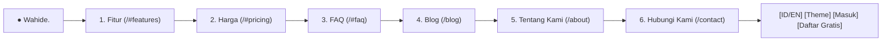

# 🧭 Rencana Arsitektur & Pelaksanaan: Penataan Ulang Navigasi Header Publik (Fitur, Harga, FAQ, Blog, Tentang Kami, Hubungi Kami)

> **Tujuan**: Menata ulang susunan menu navigasi pada [`PublicHeader.tsx`](file:///G:/WEB2026/fontwahide/src/components/layout/public/PublicHeader.tsx) agar ringkas, intuitif, dan sesuai dengan standar perambanan SaaS WhatsApp modern (**Fitur**, **Harga**, **FAQ**, **Blog**, **Tentang Kami**, **Hubungi Kami**), serta memastikan tautan *anchor scroll* (`#features`, `#pricing`, `#faq`) berfungsi mulus di halaman utama.  

---

## 📑 Daftar Isi
1. [Struktur Navigasi Header yang Dikehendaki](#1-struktur-navigasi-header-yang-dikehendaki)
2. [Penyelarasan Anchor ID pada Halaman Landing (`HomeView.tsx`)](#2-penyelarasan-anchor-id-pada-halaman-landing-homeviewtsx)
3. [Pembaruan Kamus Bilingual i18n (`common.nav.*`)](#3-pembaruan-kamus-bilingual-i18n-commonnav)
4. [Roadmap Pelaksanaan Bertahap (3 Langkah)](#4-roadmap-pelaksanaan-bertahap-3-langkah)
5. [Verifikasi Quality Gates](#5-verifikasi-quality-gates)

---

## 1. Struktur Navigasi Header yang Dikehendaki

Menu navigasi desktop dan mobile drawer akan disusun secara ergonomis berurutan:



---

## 2. Penyelarasan Anchor ID pada Halaman Landing (`HomeView.tsx`)

Memastikan seluruh target ID anchor terpasang dengan benar di [`HomeView.tsx`](file:///G:/WEB2026/fontwahide/src/components/home/HomeView.tsx):
* `id="features"` ➔ Langsung melompat ke 9 Pilar Fitur Enterprise.
* `id="pricing"` ➔ Langsung melompat ke Tabel Harga & Kuota Paket (Starter, Pro, Enterprise).
* `id="faq"` ➔ Langsung melompat ke Accordion Tanya-Jawab Interaktif.

---

## 3. Pembaruan Kamus Bilingual i18n (`common.nav.*`)

### Bahasa Indonesia (`src/locales/id/common.json`):
```json
"nav": {
  "features": "Fitur",
  "pricing": "Harga",
  "faq": "FAQ",
  "blog": "Blog",
  "about": "Tentang Kami",
  "contact": "Hubungi Kami",
  "login": "Masuk",
  "register": "Daftar Gratis",
  "dashboard": "Dashboard",
  "logout": "Keluar"
}
```

### English (`src/locales/en/common.json`):
```json
"nav": {
  "features": "Features",
  "pricing": "Pricing",
  "faq": "FAQ",
  "blog": "Blog",
  "about": "About Us",
  "contact": "Contact Us",
  "login": "Sign In",
  "register": "Start Free Trial",
  "dashboard": "Dashboard",
  "logout": "Sign Out"
}
```

---

## 4. Roadmap Pelaksanaan Bertahap (3 Langkah)

### 🔹 **Langkah 1: Pembaruan Kamus `common.nav.*`**
* Sesuaikan key terjemahan di `src/locales/id/common.json` dan `src/locales/en/common.json`.

### 🔹 **Langkah 2: Penambahan `id="faq"` di `HomeView.tsx`**
* Sematkan atribut `id="faq"` pada section FAQ Accordion di [`HomeView.tsx`](file:///G:/WEB2026/fontwahide/src/components/home/HomeView.tsx).

### 🔹 **Langkah 3: Pembaruan Komponen `PublicHeader.tsx`**
* Perbarui daftar link desktop dan drawer mobile sesuai urutan: **Fitur**, **Harga**, **FAQ**, **Blog**, **Tentang Kami**, **Hubungi Kami**.

---

## 5. Verifikasi Quality Gates

* **Uji Anchor Navigasi**: Klik menu *Fitur*, *Harga*, dan *FAQ* ➔ Halaman otomatis scroll halus (*smooth scroll*) ke bagian yang sesuai.
* **Uji Halaman Multi-Route**: Klik *Blog*, *Tentang Kami*, dan *Hubungi Kami* ➔ Membuka halaman `/blog`, `/about`, dan `/contact`.
* **TypeScript & Lint**: `tsc --noEmit` (0 errors) & `eslint` (0 warnings).
