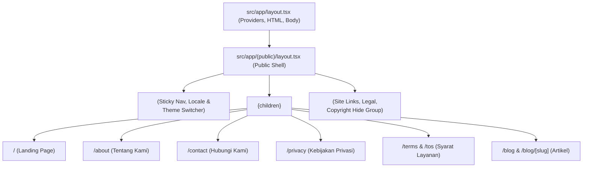

# 🎨 Rencana Arsitektur & Pelaksanaan: Penyatuan Public Layout (Header & Footer) untuk Seluruh Halaman Publik

> **Tujuan**: Menyelaraskan seluruh halaman publik (`/`, `/about`, `/contact`, `/privacy`, `/terms`, `/tos`, `/blog`) agar secara konsisten menggunakan **`PublicHeader`** dan **`PublicFooter`** yang sama persis seperti pada landing page `http://localhost:3000/`.  
> **Prinsip**: *Single Source of Truth*, *Zero Layout Duplication*, *100% DRY (Don't Repeat Yourself)*, dan *Seamless Responsive Navigation*.  

---

## 📑 Daftar Isi
1. [Analisis Masalah & Kondisi Saat Ini](#1-analisis-masalah--kondisi-saat-ini)
2. [Solusi Arsitektur: Next.js Route Group Layout `(public)/layout.tsx`](#2-solusi-arsitektur-nextjs-route-group-layout-publiclayouttsx)
3. [Daftar Halaman yang Tercakup](#3-daftar-halaman-yang-tercakup)
4. [Roadmap Pelaksanaan Bertahap (3 Langkah)](#4-roadmap-pelaksanaan-bertahap-3-langkah)
5. [Verifikasi & Quality Gates](#5-verifikasi--quality-gates)

---

## 1. Analisis Masalah & Kondisi Saat Ini

* **Kondisi Sebelumnya**:
  - `PublicHeader` dan `PublicFooter` dipanggil secara manual di dalam komponen [`HomeView.tsx`](file:///G:/WEB2026/fontwahide/src/components/home/HomeView.tsx).
  - Folder route group `src/app/(public)/` belum memiliki berkas `layout.tsx` tersendiri.
  - Akibatnya, halaman-halaman publik di bawah `src/app/(public)` seperti `/about`, `/contact`, `/privacy`, `/terms`, `/tos`, dan `/blog` tampil tanpa bilah navigasi atas (*Header*) dan bagian bawah (*Footer*).

---

## 2. Solusi Arsitektur: Next.js Route Group Layout `(public)/layout.tsx`

Dengan pola **Route Group Layout**, Next.js App Router akan otomatis membungkus seluruh rute publik dengan `PublicHeader` dan `PublicFooter` tanpa perlu mengimpornya berulang-ulang di setiap komponen tampilan (*View*).

---

## 3. Daftar Halaman yang Tercakup

| Rute URL | Berkas Halaman | Tampilan yang Dibungkus |
| :--- | :--- | :--- |
| `http://localhost:3000/` | `src/app/(public)/page.tsx` | [`HomeView.tsx`](file:///G:/WEB2026/fontwahide/src/components/home/HomeView.tsx) |
| `http://localhost:3000/about` | `src/app/(public)/about/page.tsx` | [`AboutView.tsx`](file:///G:/WEB2026/fontwahide/src/components/public/AboutView.tsx) |
| `http://localhost:3000/contact` | `src/app/(public)/contact/page.tsx` | [`ContactUsView.tsx`](file:///G:/WEB2026/fontwahide/src/components/public/ContactUsView.tsx) |
| `http://localhost:3000/privacy` | `src/app/(public)/privacy/page.tsx` | [`PrivacyView.tsx`](file:///G:/WEB2026/fontwahide/src/components/public/PrivacyView.tsx) |
| `http://localhost:3000/terms` & `/tos` | `src/app/(public)/terms/page.tsx` | [`TermsView.tsx`](file:///G:/WEB2026/fontwahide/src/components/public/TermsView.tsx) |
| `http://localhost:3000/blog` | `src/app/(public)/blog/page.tsx` | [`BlogListView.tsx`](file:///G:/WEB2026/fontwahide/src/components/public/BlogListView.tsx) |
| `http://localhost:3000/blog/[slug]` | `src/app/(public)/blog/[slug]/page.tsx` | [`BlogPostView.tsx`](file:///G:/WEB2026/fontwahide/src/components/public/BlogPostView.tsx) |

---

## 4. Roadmap Pelaksanaan Bertahap (3 Langkah)

### 🔹 **Langkah 1: Pembuatan `src/app/(public)/layout.tsx`**
* Buat berkas layout publik yang menyematkan `PublicHeader`, kontainer `<main className="flex-1">`, dan `PublicFooter`.

### 🔹 **Langkah 2: Migrasi Root Landing Page ke `(public)/page.tsx` & Refactor `HomeView.tsx`**
* Pindahkan `src/app/page.tsx` ke dalam `src/app/(public)/page.tsx`.
* Bersihkan pemanggilan ganda `PublicHeader` dan `PublicFooter` di dalam `HomeView.tsx` agar tidak terjadi duplikasi elemen visual.

### 🔹 **Langkah 3: Quality Gates & Sinkronisasi GitHub**
* Jalankan `bun x tsc --noEmit` untuk memastikan 0 type error.
* Jalankan `bun run lint` untuk memastikan 0 lint error.
* Commit dan push ke repository GitHub `origin main`.

---

## 5. Verifikasi & Quality Gates

1. Buka `http://localhost:3000/about` ➔ Verifikasi `PublicHeader` muncul di atas dan `PublicFooter` muncul di bawah.
2. Buka `http://localhost:3000/contact` ➔ Verifikasi Header & Footer konsisten.
3. Buka `http://localhost:3000/privacy` ➔ Verifikasi Header & Footer konsisten.
4. Buka `http://localhost:3000/terms` ➔ Verifikasi Header & Footer konsisten.
5. Buka `http://localhost:3000/` ➔ Verifikasi landing page tetap berjalan normal dan tidak ada duplikasi Header/Footer.
