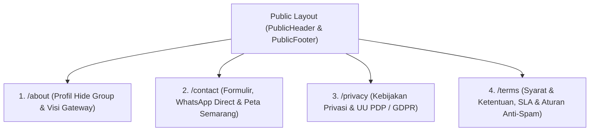
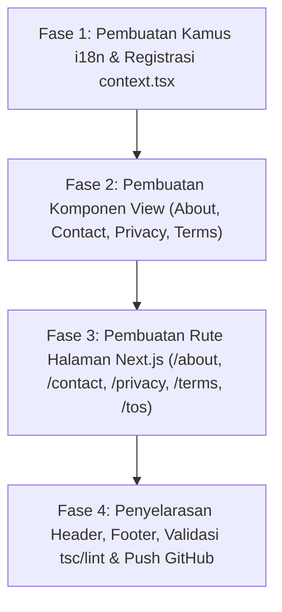

# 🏢 Rencana Arsitektur & Pelaksanaan: Halaman Publik Perusahaan & Legalitas (About Us, Contact Us, Privacy Policy, Terms of Service)

> **Pemilik Platform**: **Hide Group**  
> **Email Resmi**: `admin@hidessh.com`  
> **Alamat Kantor**: `Jl. Kampung Baris No.391, Karangturi, Kec. Semarang Tim., Kota Semarang, Jawa Tengah 50124`  
> **Kontak / WhatsApp**: `0877111301818` (`+62 877-1113-01818`)  
> **Standar Desain**: Wise Aesthetic, Dark/Light Theme Support, 100% Bilingual (ID & EN), Responsive, Accessible (Lighthouse 100).  

---

## 📑 Daftar Isi
1. [Ringkasan Eksekutif & Tujuan](#1-ringkasan-eksekutif--tujuan)
2. [Spesifikasi & Struktur Halaman Publik Baru](#2-spesifikasi--struktur-halaman-publik-baru)
   - [A. Halaman Tentang Kami (`/about`)](#a-halaman-tentang-kami-about)
   - [B. Halaman Hubungi Kami (`/contact`)](#b-halaman-hubungi-kami-contact)
   - [C. Halaman Kebijakan Privasi (`/privacy`)](#c-halaman-kebijakan-privasi-privacy)
   - [D. Halaman Syarat & Ketentuan Layanan (`/terms` & `/tos`)](#d-halaman-syarat--ketentuan-layanan-terms--tos)
3. [Rencana Data & Kamus Internasionalisasi (i18n)](#3-rencana-data--kamus-internasionalisasi-i18n)
4. [Penyelarasan Navigasi Header & Footer Publik](#4-penyelarasan-navigasi-header--footer-publik)
5. [Roadmap Eksekusi Bertahap (4 Fase)](#5-roadmap-eksekusi-bertahap-4-fase)
6. [Kriteria Pengujian & Verifikasi Kualitas](#6-kriteria-pengujian--verifikasi-kualitas)

---

## 1. Ringkasan Eksekutif & Tujuan

Untuk melengkapi kredibilitas, transparansi korporasi, serta kepatuhan hukum (*compliance*) SaaS tingkat Enterprise bagi **Wahide (Hide Group)**, dibutuhkan rangkaian halaman publik resmi yang menyajikan informasi perusahaan, saluran kontak resmi, serta instrumen hukum perlindungan data sesuai **UU Perlindungan Data Pribadi (UU PDP No. 27/2022)** dan standar global **GDPR**.

---

## 2. Spesifikasi & Struktur Halaman Publik Baru

---

### A. Halaman Tentang Kami (`/about`)
* **Rute**: `src/app/(public)/about/page.tsx` & `src/components/public/AboutView.tsx`
* **Elemen Konten**:
  1. **Profil Hide Group**: Sejarah dedikasi dalam membangun infrastruktur telekomunikasi digital, perpesanan instan, dan gateway berkinerja tinggi.
  2. **Visi & Misi**: Memberdayakan ribuan UMKM dan enterprise dengan otomasi WhatsApp resmi tanpa ketergantungan server berbiaya mahal.
  3. **Arsitektur Keunggulan Wahide**: Mesin multi-device whatsmeow, filtrasi event zero-heap, 5-lapis anti-ban, dan isolasi sesi per tenant.
  4. **Peta Markas Operasional**: Menampilkan lokasi kantor pusat di **Semarang, Jawa Tengah**.
  5. **Angka Pencapaian**: 99.9% Uptime SLA, <150MB RAM Go Runtime, Jutaan Pesan Terkirim.

---

### B. Halaman Hubungi Kami (`/contact`)
* **Rute**: `src/app/(public)/contact/page.tsx` & `src/components/public/ContactUsView.tsx`
* **Elemen Konten**:
  1. **Kartu Informasi Kontak Resmi**:
     - **Perusahaan**: Hide Group
     - **Email**: `admin@hidessh.com`
     - **WhatsApp / Telepon**: `0877111301818` (dengan tombol *Quick Chat WhatsApp Direct*)
     - **Alamat Kantor**: `Jl. Kampung Baris No.391, Karangturi, Kec. Semarang Tim., Kota Semarang, Jawa Tengah 50124`
     - **Jam Operasional**: Senin – Sabtu (08:00 – 21:00 WIB)
  2. **Formulir Pesan Interaktif**:
     - Input: Nama Lengkap, Email Bisnis, Nomor WhatsApp, Subjek, dan Pesan Pertanyaan.
     - Proteksi: Validasi input & integrasi toast feedback.
  3. **Peta Lokasi Interaktif**: Card visual lokasi Kota Semarang, Jawa Tengah.

---

### C. Halaman Kebijakan Privasi (`/privacy`)
* **Rute**: `src/app/(public)/privacy/page.tsx` & `src/components/public/PrivacyView.tsx`
* **Elemen Konten**:
  1. **Kepatuhan Regulasi**: Kepatuhan terhadap UU Perlindungan Data Pribadi (UU PDP No. 27/2022) Indonesia.
  2. **Cakupan Data yang Dikumpulkan**: Kredensial akun, token sesi WhatsApp terenkripsi, nomor kontak pelanggan (tanpa membaca isi chat pribadi pengguna).
  3. **Enkripsi & Keamanan**: Enkripsi AES-GCM 256-bit pada seluruh sesi pairing dan isolasi memori per tenant.
  4. **Hak Subjek Data**: Hak untuk mengakses, mengubah, mengunduh (*data portability*), dan menghapus permanen data (*right to be forgotten*).
  5. **Kontak Pengaduan Privasi Data**: `admin@hidessh.com`, Hide Group Semarang.

---

### D. Halaman Syarat & Ketentuan Layanan (`/terms` & `/tos`)
* **Rute**: `src/app/(public)/terms/page.tsx`, `src/app/(public)/tos/page.tsx` (alias redirect/render), & `src/components/public/TermsView.tsx`
* **Elemen Konten**:
  1. **Ketentuan Penggunaan yang Sah (*Acceptable Use Policy - AUP*)**: Larangan keras penggunaan gateway untuk aktivitas penipuan, spamming ilegal, judi online, atau konten terlarang.
  2. **Kepatuhan pada Kebijakan Meta WhatsApp**: Tanggung jawab kepatuhan nomor bisnis pengguna terhadap *WhatsApp Terms of Service*.
  3. **SLA Ketersediaan Gateway (99.9%)**: Komitmen ketersediaan infrastruktur dan pemeliharaan server berkala.
  4. **Langganan, Faktur, & Kebijakan Kuota**: Ketentuan pembayaran deposit kuota pesan, masa aktif paket, dan siklus tagihan.
  5. **Hukum yang Berlaku & Penyelesaian Sengketa**: Yurisdiksi hukum Republik Indonesia dan Pengadilan Negeri Semarang.

---

## 3. Rencana Data & Kamus Internasionalisasi (i18n)

Menambahkan namespace kamus baru atau memperluas kamus bilingual:
* **`src/locales/id/legal.json` & `src/locales/en/legal.json`**:
  Memuat teks hukum, pasal-pasal privasi, syarat layanan, serta data legalitas Hide Group.
* **`src/locales/id/about.json` & `src/locales/en/about.json`**:
  Memuat profil perusahaan, nilai-nilai teknologi, dan pencapaian platform.
* **`src/locales/id/contact_us.json` & `src/locales/en/contact_us.json`**:
  Memuat label formulir kontak, jam operasional, dan info kantor.
* Daftarkan seluruh kamus ke [`src/lib/i18n/context.tsx`](file:///G:/WEB2026/fontwahide/src/lib/i18n/context.tsx).

---

## 4. Penyelarasan Navigasi Header & Footer Publik

1. **[`PublicHeader.tsx`](file:///G:/WEB2026/fontwahide/src/components/layout/public/PublicHeader.tsx)**:
   - Tambahkan tautan menu desktop & mobile:
     - **Tentang Kami** (`/about`)
     - **Blog** (`/blog`)
     - **Hubungi Kami** (`/contact`)
     - **Harga Paket** (`/pricing` / `#pricing`)
2. **[`PublicFooter.tsx`](file:///G:/WEB2026/fontwahide/src/components/layout/public/PublicFooter.tsx)**:
   - Kolom Produk: Tambahkan tautan ke `/about` dan `/blog`.
   - Kolom Legal & Bantuan: Tautkan secara aktif ke `/terms`, `/privacy`, `/contact`, dan `/support`.
   - Bagian Copyright: Cantumkan identitas resmi *"© 2026 Hide Group. All rights reserved."*

---

## 5. Roadmap Eksekusi Bertahap (4 Fase)

### 🔹 **Fase 1: Kamus i18n & Data Perusahaan**
- Buat `src/locales/{id,en}/about.json`, `src/locales/{id,en}/contact_us.json`, dan `src/locales/{id,en}/legal.json`.
- Integrasikan data resmi Hide Group (Email `admin@hidessh.com`, Alamat Semarang, WhatsApp `0877111301818`).
- Daftarkan kamus ke `context.tsx`.

### 🔹 **Fase 2: Komponen Antarmuka (Views)**
- Bangun `AboutView.tsx` (desain Wise, highlight arsitektur, kartu Semarang).
- Bangun `ContactUsView.tsx` (form pesan, tombol WhatsApp instan, info kantor).
- Bangun `PrivacyView.tsx` (struktur pasal terstruktur, UU PDP & GDPR).
- Bangun `TermsView.tsx` (struktur pasal AUP, SLA 99.9%, hukum Semarang).

### 🔹 **Fase 3: Rute App Router Next.js**
- Buat `src/app/(public)/about/page.tsx`.
- Buat `src/app/(public)/contact/page.tsx`.
- Buat `src/app/(public)/privacy/page.tsx`.
- Buat `src/app/(public)/terms/page.tsx` dan `src/app/(public)/tos/page.tsx`.

### 🔹 **Fase 4: Integrasi Header, Footer, & Quality Gates**
- Perbarui `PublicHeader.tsx` dan `PublicFooter.tsx`.
- Verifikasi `bun x tsc --noEmit` (0 error) dan `bun run lint` (0 warning).
- Commit dan push ke repository GitHub `main`.

---

## 6. Kriteria Pengujian & Verifikasi Kualitas

| Parameter Pengujian | Target Kualitas |
| :--- | :--- |
| **Akurasi Data Perusahaan** | Alamat Semarang, email `admin@hidessh.com`, no `0877111301818` tampil konsisten |
| **Bilingual Switcher (ID & EN)** | Penggantian bahasa via LocaleSwitcher langsung memperbarui seluruh isi pasal dan form |
| **SEO & OpenGraph Metadata** | Setiap halaman memiliki title, description, dan canonical URL yang valid |
| **Responsive & Dark/Light Mode** | Tampilan presisi di resolusi mobile (360px), tablet, hingga desktop lebar |
| **Quality Gates** | `tsc --noEmit` ➔ 0 Errors, `eslint` ➔ 0 Warnings |
