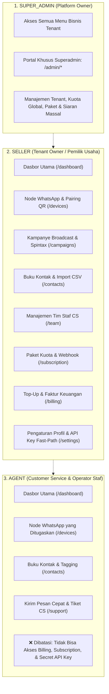

# 🗺️ Analisis & Perencanaan Teknis: Navigasi Sidebar, Diferensiasi Role (RBAC) & Arsitektur SPA

> **Lokasi Target**: `G:\WEB2026\fontwahide\src\app\(dashboard)` & `src/components/layout/dashboard/`  
> **Evaluasi**: Role Seller vs Role Superadmin vs Role CS Agent & Verifikasi 100% Single Page Application (SPA)  

---

## 📑 Daftar Isi
1. [Ringkasan Eksekutif & Status Saat Ini](#1-ringkasan-eksekutif--status-saat-ini)
2. [Analisis Matriks Role-Based Access Control (RBAC)](#2-analisis-matriks-role-based-access-control-rbac)
3. [Diferensiasi Item Sidebar Berdasarkan Role](#3-diferensiasi-item-sidebar-berdasarkan-role)
4. [Verifikasi Menyeluruh Arsitektur SPA (Zero Page Reload)](#4-verifikasi-menyeluruh-arsitektur-spa-zero-page-reload)
5. [Rencana Aksi & Implementasi Teknis](#5-rencana-aksi--implementasi-teknis)

---

## 1. Ringkasan Eksekutif & Status Saat Ini

Berdasarkan audit mendalam pada struktur kode `G:\WEB2026\fontwahide\src\app\(dashboard)`:

1. **Diferensiasi Role pada Sidebar**:
   - **Sudah Terimplementasi untuk Super Admin**: Pada [`DashboardSidebar.tsx`](file:///G:/WEB2026/fontwahide/src/components/layout/dashboard/DashboardSidebar.tsx#L129-L150), terdapat logika kondisional `user?.role === "SUPER_ADMIN"` yang memunculkan seksi khusus berlatar merah lembut (*Protected Shell*) menuju portal **`/admin/overview`**.
   - **Perlu Penyempurnaan untuk Role CS Agent & Penambahan Modul Tim**: Item navigasi **Tim CS & Operator (`/team`)** perlu ditambahkan ke dalam `DASHBOARD_NAV_ITEMS`, dan filter hak akses (`allowedRoles`) perlu dipasang agar staf CS (`AGENT`) tidak melihat menu sensitif seperti Faktur (*Billing*) dan Paket Langganan (*Subscription*).

2. **Status Single Page Application (SPA)**:
   - **100% SUDAH SPA PENUH**:
     - Seluruh tautan navigasi menggunakan komponen `next/link` (`<Link href="...">`).
     - Tidak ada reload halaman (*zero full-page browser refresh*).
     - Form submit dicegah dengan `e.preventDefault()` dan dieksekusi secara asinkron.
     - State login (token), konteks bahasa (i18n), dan tema (dark/light) tetap tersimpan di memori saat berpindah antar halaman.

---

## 2. Analisis Matriks Role-Based Access Control (RBAC)

Aplikasi **Wahide** mendukung 3 tingkatan peran (*Role Hierarchy*):



---

## 3. Diferensiasi Item Sidebar Berdasarkan Role

Tabel pemetaan hak akses navigasi pada Sidebar:

| Modul Navigasi | Rute | Ikon | Role SELLER | Role AGENT | Role SUPER_ADMIN |
| :--- | :--- | :--- | :---: | :---: | :---: |
| **Overview** | `/dashboard` | `LayoutDashboard` | ✅ Akses | ✅ Akses | ✅ Akses |
| **Slot WhatsApp** | `/devices` | `Smartphone` | ✅ Akses | ✅ Akses | ✅ Akses |
| **Kampanye Broadcast** | `/campaigns` | `Send` | ✅ Akses | ✅ Akses | ✅ Akses |
| **Buku Kontak** | `/contacts` | `Users` | ✅ Akses | ✅ Akses | ✅ Akses |
| **Tim CS & Operator** | `/team` | `UserCheck` | ✅ Akses | ❌ Tersembunyi | ✅ Akses |
| **Paket & Kuota** | `/subscription` | `CreditCard` | ✅ Akses | ❌ Tersembunyi | ✅ Akses |
| **Faktur & Tagihan** | `/billing` | `Receipt` | ✅ Akses | ❌ Tersembunyi | ✅ Akses |
| **Tiket Bantuan** | `/support` | `LifeBuoy` | ✅ Akses | ✅ Akses | ✅ Akses |
| **Pengaturan & API** | `/settings` | `Settings` | ✅ Akses | ⚠️ Profil Saja | ✅ Akses |
| **Panel Superadmin** | `/admin/overview` | `ShieldAlert` | ❌ Tersembunyi | ❌ Tersembunyi | ✅ **Aktif Khusus** |

---

## 4. Verifikasi Menyeluruh Arsitektur SPA (Zero Page Reload)

Aplikasi telah memenuhi seluruh kriteria arsitektur **Modern Single Page Application (SPA)**:

### 4.1. Client-Side Routing Intercept
Setiap item menu di render menggunakan `next/link` dengan styling aktif otomatis berbasis `usePathname()`:
```tsx
// src/components/layout/dashboard/DashboardSidebar.tsx
<Link
  key={item.href}
  href={item.href}
  onClick={onItemClick}
  className={cn(
    "flex items-center justify-between px-3.5 py-2.5 rounded-full text-xs font-semibold transition-all duration-150",
    isActive
      ? "bg-wise-green text-dark-green font-bold shadow-sm"
      : "text-foreground-secondary hover:text-foreground hover:bg-muted"
  )}
>
  <div className="flex items-center gap-3">
    <Icon className={cn("size-4", isActive ? "text-dark-green" : "text-foreground-muted")} />
    <span>{t(item.key)}</span>
  </div>
</Link>
```

### 4.2. Asynchronous Form & State Persistence
* Semua aksi modal (Tambah Device, Tambah Kontak, Buat Broadcast, Top-Up Saldo, Buat Tiket) mengeksekusi request `fetch`/`httpClient` di background.
* Menggunakan feedback notifikasi toast **Sonner** (`toast.success()`, `toast.error()`) tanpa memicu navigasi paksa atau refresh URL browser.

---

## 5. Rencana Aksi & Implementasi Teknis

Untuk menyempurnakan diferensiasi role pada Sidebar:

1. **Tambahkan Navigasi `/team` ke `DASHBOARD_NAV_ITEMS`**:
   - Menambahkan entri `"dashboardMenu.team"` dengan icon `UserCheck` yang mengarah ke `/team`.
2. **Pasang Property `roles?: UserRole[]` pada Entri Menu**:
   - Menambahkan filter dinamis: `DASHBOARD_NAV_ITEMS.filter(item => !item.roles || item.roles.includes(userRole))`.
3. **Update Kamus Bahasa i18n**:
   - Menambahkan `"team": "Tim CS & Operator"` pada `src/locales/id/common.json` dan `"team": "CS Team & Agents"` pada `src/locales/en/common.json`.
4. **Verifikasi Validasi Compiler**:
   - Menjalankan `bun x tsc --noEmit` dan `bun run lint` untuk memastikan zero errors.
